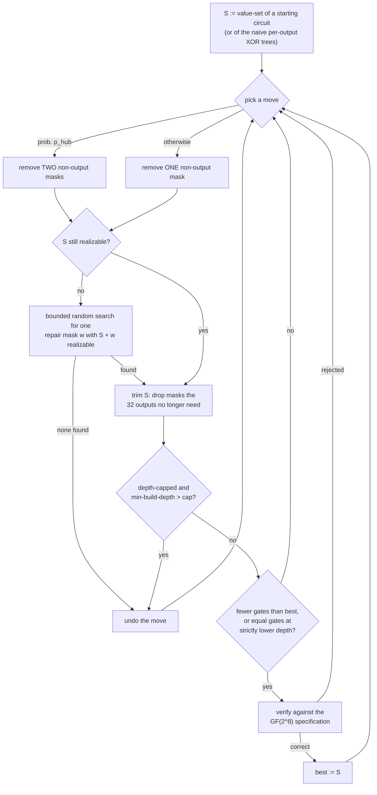
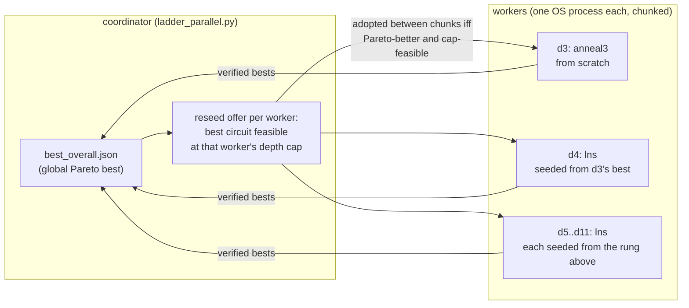

# The method: value-set SLP search with plateau and hub moves

This document specifies the search method behind the record AES MixColumns
XOR circuits (97 gates at depth 3, 92 at depth 4, 89 at depth 5 — see
`evidence/RESULTS.md` and the artifact repository
[aes-mixcolumns-xor-circuits](https://github.com/Joe-b-20/aes-mixcolumns-xor-circuits)).
Everything here is implemented in dependency-free Python in this repository
and runs with no AI system in the loop.

## 1. Problem and model

Implement the AES MixColumns map — a 32×32 matrix over GF(2) — as a circuit
of 2-input XOR gates, minimizing the gate count (the Shortest Linear Program
problem, NP-hard), optionally under a depth cap. The specification is rebuilt
from the GF(2⁸) definition in `*/mixcolumns_core.py`; an independent oracle
(`verify_circuit.py`) checks every claimed circuit.

## 2. The representation: circuits as value-sets

A circuit is represented not as an ordered gate list but as a **set of GF(2)
bit-masks** over the 32 inputs (one mask per gate output). A set is a valid
circuit iff it is *realizable* — starting from the 32 input singletons, every
mask in the set equals the XOR of two already-available masks — and contains
all 32 MixColumns output masks. Gate count = |set|. The representation makes
"delete a gate and see if the circuit still works" a set operation, and makes
two circuits comparable by mask overlap regardless of gate ordering.

## 3. The motivating observation

In the published record circuits, every gate is locally efficient — each
looks like an optimal step. That is the signature of greedy construction, and
it suggests such circuits sit at local optima: any further reduction has to
pass through intermediate circuits that contain locally *suboptimal* steps.
The method is therefore built around moves that are individually neutral or
worse but globally productive, and acceptance rules that let the search
traverse them.

## 4. The moves

- **remove-1**: drop a non-output mask; keep the smaller set if it is still
  realizable. (A genuine −1 cut; rarely available on good circuits.)
- **neutral swap (plateau walk)**: when no removal works, remove one mask and
  add one *repair* mask that restores realizability — size unchanged. Walking
  this plateau of equal-size circuits rearranges the sharing structure until
  some mask becomes jointly redundant and a remove-1 fires.
- **remove-2-add-1 ("hub" move)**: remove two masks, add one repair mask —
  the only local move that nets −1 when remove-1 is exhausted. Pair selection
  is biased toward masks whose XOR has low Hamming weight (likely to admit a
  shared "hub" replacement).
- **depth-aware reconstruction**: for depth-capped search, a fixpoint
  computation (`relax`) gives each mask's minimum build depth over the set;
  candidates are rejected if any mask exceeds the cap, and gate lists are
  emitted in depth order (`order_by_depth`). This turns any realizable set
  into an explicit circuit respecting the cap.

One iteration of the core loop, as a flowchart:

## 5. The engines

Three engines share the moves and the verify-before-claim contract (an engine
never claims a count; it proposes candidates, and a candidate becomes "best"
only after the GF(2⁸) oracle verifies it at the active depth cap):

- **`walk`** (`pipeline/engines.py:engine_walk`): the value-set local search —
  remove-1 plus hub moves plus plateau slack, with repair.
- **`lns`** (`engine_lns`): large-neighbourhood re-synthesis. Destroy k
  non-output masks (k random, occasionally large), rebuild greedily from a
  pool (current masks, their pairwise sums, and accumulated good masks) with
  refcount-aware extraction, accept rebuilds that are no larger (or slightly
  larger, with probability `up_prob` — the uphill steps that escape local
  optima), periodically peel removable masks, and snap back to the best set
  if the walk drifts too far. The main hunter for depth ≥ 4 and warm starts.
- **`anneal3`** (`engine_anneal3`): a from-scratch depth-3 constructor. Model
  each output as A ⊕ B where A, B partition its bits into depth-≤2 parts;
  auxiliary signals are depth-1 pairs (weight 2) and depth-2 parts (weight
  3–4) that are refcount-costed, so shared parts are paid once. Simulated
  annealing over the per-output split choices, plus greedy descent and
  iterated local search with random kicks. Depth ≤ 3 holds by construction.

## 6. The pipeline

`pipeline/ladder_parallel.py` orchestrates OS-process workers
(`worker.py`), each running one engine at one depth cap in fixed-length
chunks. Two orchestration ideas matter:

- **Pareto tie-break**: a worker's `improve()` accepts a candidate with fewer
  gates, **or equal gates at strictly lower depth**. Equal-gate-shallower
  circuits are surfaced by the engines rather than discarded — this is how
  89 @ depth 6 became 89 @ depth 5 within minutes of being offered as a seed.
- **Reseeding / the ladder**: the coordinator tracks the global best and
  offers each worker the best circuit feasible at its depth cap; workers
  adopt offers that Pareto-beat their own best between chunks. In cascade
  mode, rung d3 starts from scratch (`anneal3`) and each deeper rung launches
  seeded from the previous rung's best — the from-scratch lineage documented
  in `evidence/RESULTS.md` came from exactly this ladder.

Every run self-archives its exact code into its output folder, so archived
results are always reproducible from their own directory.

## 7. Reproducing the records

- **97 @ depth 3**: `reproduce/reproduce.py` — single command, single core,
  from scratch, minutes.
- **89 @ depth 5**: `pipeline/` with `MODE="fixed"` — the exact two-worker
  configuration of the run that found it, warm-started from the shipped
  89@depth6 and 90@depth5 circuits (~10–15 minutes).
- **92 @ depth 4**: `pipeline/` with `MODE="cascade"` — the from-scratch
  depth ladder (hours).

`reproduce/reproduce.py` also carries opt-in legacy demonstrations of the
moves on superseded records (plateau-walk reduction of the published 92-gate
circuit of Xiang, Zeng, Lin, Bao, and Zhang to 91; a 90→89 hub-walk cut; an
irreducibility demonstration), with seed provenance stated per method. The
runs in `evidence/` each contain the exact code, config, logs, and every
verified best, and `pipeline/README.md` documents how the code evolved
between the three record runs.

## 8. History

The search programs were originally written and executed by LLM coding
agents, used as programming tools under the author's direction; the moves and
acceptance rules above were designed by the author. The method was then
reimplemented as the dependency-free Python in this repository, which
reproduces the results with no AI involvement. Every circuit ever claimed —
here or in the artifact repository — is machine-verified against MixColumns
rebuilt from GF(2⁸).

## 9. Provenance of the earlier (v1) circuits

The project's first three circuits — 98 @ depth 3, 91 @ depth 6, and 89 @
depth 10, released 2026-07-10 and now superseded — were found by earlier,
more primitive versions of the same search. **The exact code state that
produced them was not preserved**: it was edited in place before being
archived. That mistake is the direct reason for the current pipeline's
discipline of self-archiving its exact code into every run folder, which is
why every v2 record has a complete, checkable code-and-log trail and the v1
circuits do not.

What is reconstructable is stated plainly:

- **91 @ depth 6** was obtained by the neutral-swap plateau walk applied to
  the published 92-gate circuit of Xiang, Zeng, Lin, Bao, and Zhang; the same
  reduction replays live in `reproduce/reproduce.py` (method `"91"`).
- **89 @ depth 10** came from seeded value-set walks; the equivalent 90→89
  reduction replays in method `"89"`. Its original discovery path is not
  cleanly reconstructable.
- **98 @ depth 3** came from an early version of the depth-3 constructor of
  Section 5.

None of the current claims depends on the v1 circuits or on how they were
found: the v2 records dominate all three and carry fully logged from-scratch
lineages (Section 7, `evidence/RESULTS.md`), and the v1 circuits remain in
the artifact repository as verified artifacts — correctness is
machine-checkable regardless of provenance.
