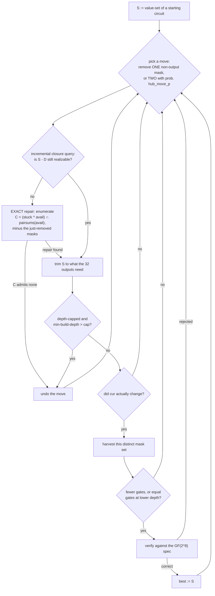
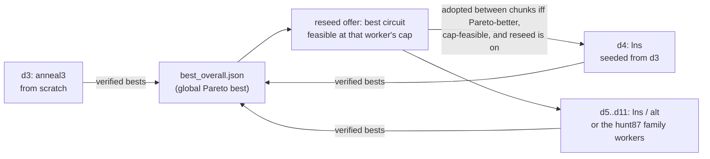
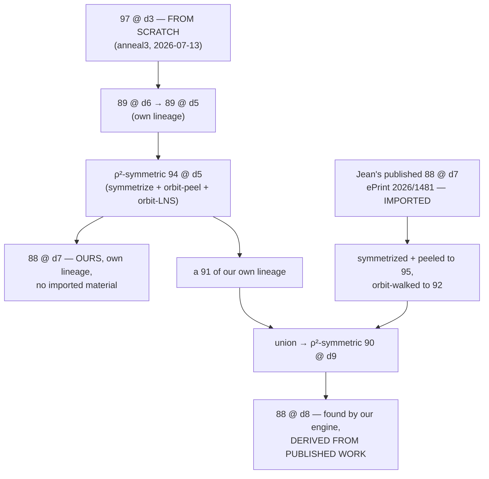

# The method: value-set SLP search, plateau walking, and exact local certificates

This document specifies the search method behind the record AES MixColumns
XOR circuits (97 gates at depth 3, 92 at depth 4, 89 at depth 5, 88 at depth 7
and 88 at depth 8 — see `evidence/RESULTS.md` and the artifact repository
[aes-mixcolumns-xor-circuits](https://github.com/Joe-b-20/aes-mixcolumns-xor-circuits)).
Everything here is implemented in dependency-free Python in this repository
and runs with no AI system in the loop.

## 1. Problem and model

Implement the AES MixColumns map — a 32×32 matrix over GF(2) — as a circuit
of 2-input XOR gates, minimizing the gate count (the Shortest Linear Program
problem, NP-hard), optionally under a depth cap. The specification is rebuilt
from the GF(2⁸) definition in `*/mixcolumns_core.py`; an independent oracle
(`verify_circuit.py`) checks every claimed circuit. Nothing here is claimed
optimal: the negative results of Section 10 are local, and none of them bounds
87 away globally.

## 2. The representation: circuits as value-sets

A circuit is represented not as an ordered gate list but as a **set of GF(2)
bit-masks** over the 32 inputs (one mask per gate output). A set is a valid
circuit iff it is *realizable* — starting from the 32 input singletons, every
mask in the set equals the XOR of two already-available masks — and contains
all 32 MixColumns output masks. Gate count = |set|. The representation makes
"delete a gate and see if the circuit still works" a set operation; makes two
circuits comparable by mask overlap regardless of gate ordering (the Jaccard
index used for families in Section 11); and makes a *neighbourhood* — "remove
these k masks, add at most k−1 others" — a finite object that can be enumerated
exhaustively (Section 10).

## 3. The motivating observation

In the published record circuits, every gate is locally efficient — each
looks like an optimal step. That is the signature of greedy construction, and
it suggests such circuits sit at local optima: any further reduction has to
pass through intermediate circuits that contain locally *suboptimal* steps.
The method is therefore built around moves that are individually neutral or
worse but globally productive, and acceptance rules that let the search
traverse them.

At 88 gates that reading is now measured rather than assumed: every local move
class small enough to enumerate is **empty** on every 88 examined (Section 10).
Nothing is gained by searching harder for one clever step; what produced both
new 88-gate circuits was the opposite — making the *equal-size* plateau cheap
to walk, and walking a very large amount of it.

## 4. The moves

- **remove-1**: drop a non-output mask; keep the smaller set if it is still
  realizable. (A genuine −1 cut; rarely available on good circuits.)
- **neutral swap (plateau walk) with exact repair**: remove one mask and add
  one *repair* mask that restores realizability — size unchanged. The repair set
  is now enumerated completely rather than sampled. After the removal let
  `A = closure(S₂)` and `stuck = (S₂ ∪ T) − A`. A mask `w` can repair `S₂` only
  if (a) it is buildable now, i.e. `w ∈ P₂(A)`, the pair-sums of `A`, and (b) it
  unlocks something, i.e. `w = u ^ a` for some `u ∈ stuck`, `a ∈ A`. So
  `C = {u ^ a} ∩ P₂(A)` **contains every possible single-mask repair**, and
  iterating over it decides the move (`pipeline/engines.py:_repair`). Measured
  `|C| ≈ 7` — complete enumeration is *cheaper* than the 24–40 random candidates
  the previous engine tried, which missed 81–82 % of the repairs that existed.
  Exact repair gave ~7× plateau mobility (1.9 → 13.6–16.3 distinct states/s) and
  is how both new 88s were reached. The just-removed masks are passed as
  `forbid`: re-adding one is a ping-pong no-op.
- **remove-2-add-1 ("hub" move)**: remove two masks, add one repair mask. Kept
  in the walk (`hub_move_p`) as a diversifier, but at the 88/89 frontier it is
  **provably dead** — Section 8.
- **destroy-and-rebuild (LNS)**: remove a group of masks and re-synthesize from
  a candidate pool. Three operators are mixed (`op_mix`): `small` (1–4 random
  masks), `coneinj` (a *connected* cone of the circuit DAG plus injected local
  candidates), `biginj` (a large random destroy plus injection). Removing a cone
  leaves a hole the rebuild can genuinely re-plan; k unrelated masks usually just
  get re-derived — `coneinj` measured ~12× improvements/s and is the only
  operator that makes destroy sizes 3–4 productive.
- **depth-aware reconstruction**: `relax` gives each mask's minimum build depth
  over the set; candidates over the cap are rejected and gate lists emitted in
  depth order (`order_by_depth`), turning any realizable set into an explicit
  circuit respecting the cap. Uncapped, any topological witness from the closure
  is already a valid circuit (`_walk_gates`) at ~50× less cost.

```mermaid
flowchart TD
    A["S := value-set of a starting circuit"] --> B{"pick a move:<br/>remove ONE non-output mask,<br/>or TWO with prob. hub_move_p"}
    B --> E{"incremental closure query:<br/>is S - D still realizable?"}
    E -->|no| F["EXACT repair: enumerate<br/>C = (stuck ^ avail) ∩ pairsums(avail),<br/>minus the just-removed masks"]
    F -->|"C admits none"| G["undo the move"] --> B
    F -->|"repair found"| H
    E -->|yes| H["trim S to what the 32 outputs need"]
    H --> I{"depth-capped and<br/>min-build-depth > cap?"}
    I -->|yes| G
    I -->|no| J{"did cur actually change?"}
    J -->|no| B
    J -->|yes| K["harvest this distinct mask set"]
    K --> L{"fewer gates, or equal<br/>gates at lower depth?"}
    L -->|no| B
    L -->|yes| M["verify against the GF(2^8) spec"]
    M -->|correct| N["best := S"] --> B
    M -->|rejected| B
```

## 5. The kernel: closure, relax, and the improve-spam fix

Both search engines spend nearly all their time answering two questions — "what
can this mask set build?" and "at what depth?" — so the kernel is where
throughput lives. Three rewrites, each checked against the function it replaced,
plus one bug that dominated everything else:

| change | what it does | measured |
|---|---|---|
| `relax`, level-BFS | resolves build depth one level at a time, so a mask is tested only against the level that could lower it; same least fixpoint, bit-identical 1 500-iteration trajectories | **17.5×** end-to-end LNS (42.3 → 739 it/s); 18.9× per call |
| `_closure_core`, worklist BFS | re-tests a mask only when a *new* mask it could pair with appears, with a `stop_at_targets` early exit for feasibility and trim | O(\|S\|²) instead of repeated full re-scans |
| `_WalkState.remove_query` | marks only the masks whose derivation transitively used a removed mask and re-derives those; still the exact least fixpoint of `S − D` | part of the 21.9× below |
| improve-spam fix | the Pareto tie-break called `ctx.improve` (full relax + oracle verify) on *every* plateau iteration, including rejected moves where `cur` never changed — **78 % of walk runtime** | **21.9×** walk (12.3 → 269 it/s; ~395–430 on 4 procs) |

`relax_reference` is kept verbatim as ground truth and as the duplicate-mask
fallback. End to end the merged engine walks at **480–640 it/s** against ~70–110
before (~6×) and runs LNS at ~100–180 against ~60–100 (~2×), with much richer
neighbourhoods. Smoke gate: from `pipeline/seeds/seed_90_at_depth5.json` the
walk reached a verified 89 @ depth 5 in 42 s in the archived run.

## 6. The engines

Three engines share the moves and the verify-before-claim contract (an engine
never claims a count; it proposes candidates, and a candidate becomes "best"
only after the GF(2⁸) oracle verifies it at the active depth cap):

- **`walk`** (`pipeline/engines.py:engine_walk`) — remove-1 and hub moves over
  the incremental closure, with exact repair. Both new 88s came from walk chunks.
- **`lns`** (`engine_lns`) — destroy and rebuild, with the mechanisms below.
- **`anneal3`** (`engine_anneal3`) — a from-scratch depth-3 constructor. Each
  output is modelled as A ⊕ B where A, B partition its bits into depth-≤2 parts;
  auxiliary signals are refcount-costed, so shared parts are paid once.
  Simulated annealing over the per-output split choices, plus greedy descent and
  iterated local search with random kicks. Depth ≤ 3 holds by construction.

| LNS mechanism | why | measured |
|---|---|---|
| **victim-repool** (`_extract` cost classes: 1 kept, 2 sampled/injected, 3 just-destroyed victim) | victims stay available instead of being excluded, so a rebuild never dead-ends, while the higher cost still pushes it elsewhere. Before, 98.8 % of iterations bailed at `_extract`'s up-front check *after* paying for `relax` | **~34×** accepted moves/s; 100 % feasible iterations |
| **scored pools** (current masks + pairwise sums + accumulated masks; a "hot" list of masks a rebuild actually reintroduced, drawn `hot_frac` of the time) | concentrates candidates on what has already proved useful here | **~11×** accepted moves; 16–18× pool hit rate |
| **peel-before-accept** (`peel_window`) | a rebuild a few masks too big is usually redundant, not wrong; peeling before judging it is also what makes the large `biginj` destroys viable | **2 630** near-miss rebuilds recovered in a 2-minute probe |
| **SA with reheat** (`sa_T0`, `sa_cool`, `sa_reheat`) | uphill rebuilds on a cooling schedule that resets when no new best has appeared for `sa_reheat` iterations; the old threshold rule stays selectable | **~2×** drift, best simple schedule tested |

**Plateau harvesting** (`_Harvester`, shared by both search engines) is the other
half of the story. Only a strictly better — or equal-size but shallower —
circuit is ever exported, yet the search constantly walks over sibling circuits
of the same size and used to discard them. Harvesting appends every distinct
equal-best mask set to a `.pop.jsonl` population file: that is where the
≈ 139 878 distinct known 88-gate states came from, and both new 88s were found
inside harvesting runs. With `pop_glob` a worker also merges **sibling** workers'
harvests into its rebuild pool (cross-pollination). That knob is LNS-only and is
**off in the shipped configuration**: it mixes the mask provenance of every
worker in a run, and a circuit built from a pool containing imported masks is
"derived from published work" (Section 9).

## 7. The pipeline

`pipeline/ladder_parallel.py` orchestrates OS-process workers (`worker.py`),
each running one engine at one depth cap in fixed-length chunks. The engine name
`alt` is a worker *mode*, not an engine: it alternates a short walk chunk with a
longer LNS chunk on the same circuit, and that is what the best-performing hunt
workers ran, including both that found the 88s.

- **Pareto tie-break**: a worker's `improve()` accepts a candidate with fewer
  gates, **or equal gates at strictly lower depth**. Equal-gate-shallower
  circuits are surfaced rather than discarded — this is how 89 @ depth 6 became
  89 @ depth 5 within minutes of being offered as a seed, and how both 88s
  (first seen at depth 11 and depth 10) were tie-broken to depth 7 and depth 8
  seconds later.
- **Reseeding / the ladder**: the coordinator tracks the global best and offers
  each worker the best circuit feasible at its depth cap; workers adopt offers
  that Pareto-beat their own best between chunks. In cascade mode rung d3 starts
  from scratch (`anneal3`) and each deeper rung is seeded from the rung above —
  the from-scratch lineage in `evidence/RESULTS.md` came from this ladder.
- **Family workers**: the shipped `hunt87` set runs one uncapped worker per known
  88-gate family (Section 11) with `reseed=False`, plus one depth-capped worker
  on the depth frontier. Opting out of reseeding is deliberate — an equal-size
  shallower offer would collapse all three family workers onto one circuit and
  throw away the diversity the set exists for.

Every run self-archives its exact code into its output folder, so archived
results are always reproducible from their own directory.

```mermaid
flowchart LR
    W1["d3: anneal3<br/>from scratch"] -- "verified bests" --> BO["best_overall.json<br/>(global Pareto best)"]
    W2["d4: lns<br/>seeded from d3"] -- "verified bests" --> BO
    W3["d5..d11: lns / alt<br/>or the hunt87 family workers"] -- "verified bests" --> BO
    BO --> RS["reseed offer: best circuit<br/>feasible at that worker's cap"]
    RS -- "adopted between chunks iff Pareto-better,<br/>cap-feasible, and reseed is on" --> W2
    RS --> W3
```

## 8. What was measured and rejected

Negative results are part of the evidence, and several of them redirected the
search:

| finding | evidence |
|---|---|
| **the hub move is dead at the frontier** | 0 successes in ~2.24 M repair samples across all seeds, then proven exactly: the remove-2-add-1 neighbourhood of every one of the five 89 seeds is *empty*, and likewise inside the certified k ≤ 3 shells of Section 10 |
| **knobs are not the lever** | a wide grid sweep gave **0 improvements in 101 runs**; the shipped values are measured-good, but throughput and neighbourhood *shape* are what move the search |
| **LAHC is inert** in this acceptance role | provably so; SA-with-reheat replaced it |
| **uniform destroys do not rebuild** | uniform sizes 3…6 gave 0 accepts in 5 633 attempts, the periodic `kshake` destroy 0 in 293 — which motivated the connected-cone operator and injection |
| **random repair is worse than exhaustive** | missed 81–82 % of existing repairs at higher cost than enumerating all ≈ 7 (Section 4) |

Near-dead knobs are documented rather than silently kept: `up_prob` is a binary
drift switch, `nsamp=(48,48)` is 3× slower for no benefit, `kmax ≥ 10` is wasted.

## 9. Provenance: what is ours, what is derived, what is imported

Every circuit is reported in one of three classes: **from scratch** (no seed at
all); **own lineage** (seeded from this project's own prior output, transitively
back to a from-scratch root); **derived from published work** (the seed chain
passes through someone else's circuit, however far back — ours to *report*,
never ours to *claim*, and always credited).

The two circuits found in the 2026-07 campaign fall in different classes, and
the difference is stated wherever either appears:

```mermaid
flowchart TD
    R["97 @ d3 — FROM SCRATCH<br/>(anneal3, 2026-07-13)"] --> S89["89 @ d6 → 89 @ d5<br/>(own lineage)"]
    S89 --> S94["ρ²-symmetric 94 @ d5<br/>(symmetrize + orbit-peel + orbit-LNS)"]
    S94 --> N88["88 @ d7 — OURS, own lineage,<br/>no imported material"]
    S94 --> O91["a 91 of our own lineage"]
    J["Jean's published 88 @ d7<br/>ePrint 2026/1481 — IMPORTED"] --> J92["symmetrized + peeled to 95,<br/>orbit-walked to 92"]
    J92 --> U["union → ρ²-symmetric 90 @ d9"]
    O91 --> U
    U --> T88["88 @ d8 — found by our engine,<br/>DERIVED FROM PUBLISHED WORK"]
```

- The **88 @ depth 7** is own lineage, rooted in the from-scratch 97 @ depth 3.
  No imported mask enters the chain: the walk engine has no pool and only adds
  masks derived from its own value set's closure, cross-pollination is an
  LNS-only knob, and in the archived run every improvement on that worker came
  from a walk chunk — its 89 @ 7 predates the worker's first cross-pollination
  event, and no LNS chunk there ever improved the best. It **matches** the
  published record (Jean, ePrint 2026/1481) **with an independent circuit** —
  61 of 88 masks shared, Jaccard 0.530. It does not beat it.
- The **88 @ depth 8** was found by our engine, but **its seed chain passes
  through Jean's published circuit**: Jean's 88 was ρ²-symmetrized and peeled to
  95, orbit-walked to 92, unioned with a 91 of our own lineage to give the
  ρ²-symmetric 90 @ 9, which was descended to the 88 @ 8. It is a third distinct
  family, worth documenting as a construction, but dominated by the 88 @ 7 (same
  size, greater depth) — not a frontier point, and reported as derived work.
- **Imported circuits are always credited, never counted as results**: Jean,
  ePrint 2026/1481 (88 gates) and Sun–Yang–Li, ePrint 2025/1493 (89 gates).
  Neither paper states a depth; the depths quoted here — 7 and 9 — are this
  repo's measurements of its own transcriptions. Both are oracle-verified and
  kept under `evidence/campaign87_imported_prior_art/` and `pipeline/seeds/`
  with `_imported` in the filename.

### The earlier (v1) circuits

The project's first three circuits — 98 @ depth 3, 91 @ depth 6, and 89 @
depth 10, released 2026-07-10 and now superseded — were found by earlier, more
primitive versions of the same search. **The exact code state that produced them
was not preserved**: it was edited in place before being archived. That mistake
is the direct reason for the pipeline's discipline of self-archiving its exact
code into every run folder, which is why every later record has a complete,
checkable code-and-log trail and the v1 circuits do not. What is reconstructable
is stated plainly: **91 @ depth 6** came from the neutral-swap plateau walk
applied to the published 92-gate circuit of Xiang, Zeng, Lin, Bao, and Zhang,
and that reduction replays in `reproduce/reproduce.py` (method `"91"`);
**89 @ depth 10** came from seeded value-set walks, with the equivalent 90→89
reduction replaying in method `"89"` (its original discovery path is not cleanly
reconstructable); **98 @ depth 3** came from an early version of the depth-3
constructor of Section 6. No current claim depends on them — the later records
dominate all three — and they remain in the artifact repository as verified
artifacts, correctness being machine-checkable regardless of provenance.

## 10. Exact neighbourhood certificates

A search can only report what it found. To say anything about what is *not*
there, the repo uses a decision procedure instead.

**The question.** Given a verified 88-gate circuit and a *window* of k masks
removed from it, can at most k−1 new masks — each buildable at the moment it is
added, with cascade unlocks in between — restore all 32 targets? A "yes" is an
87-gate circuit; a "no", run to completion, is a proof for that window.

**The procedure.** Frontier-cascade closure with rollback, decided by budget:
budget 1 (k = 2), budget 2 (k = 3), budget 3 (k = 4). Completeness is proved by
first-unlock case analysis in the producing module's docstring — the first
unlock must have the newest added mask as a parent, which pins each added mask
to a finite, enumerable shape — so a `None` answer with no deadline expiry is a
machine-checked proof, not a failed search. Runs above the proved budget are
recorded as `nosol`, never as `irreducible`. Validation: budgets 1 and 2 agree
with an independent brute force 25/25 and 12/12; budget 3 agrees on **1 257
instances including 122 genuine NOs**, identically under CPython 3.10 and
PyPy 3.11.

**What is proven** (full write-up and archived verdict summaries:
`evidence/campaign87_certificates/CERTIFICATES.md`):

- **47 canonical 88-gate circuits have exhaustively empty k ≤ 3 shells** — all
  1 540 k=2 windows and all 27 720 k=3 windows each, zero reducible: Jean's 88,
  its 12 plateau siblings, and the third-family anchor with 33 representatives.
  Consequence: **any 87-gate circuit differs from each of them by ≥ 4 masks.**
  This project's own 88 @ 7 is **not** among the 47 — its exhaustive k ≤ 3 sweep
  was never run; what it has is 9 exact k=4 windows and 8 SAT cone windows.
- **Population sweeps.** 105 801 of the ≈ 139 878 known distinct 88-gate states
  are proven irreducible at k=2: 51 899 of families 1–2 (61.1 %, ordered
  most-distant-first, so the entire symmetric-difference ≥ 55 band is closed;
  33 090 remain, resumable) plus **all 53 902 of family 3 (100 %, closed)**. At
  k=3 the 19 most theorem-starved population states were closed exhaustively
  (526 680 decisions, all irreducible).
- **k=4** (remove 4, restore with ≤ 3), partial but prioritised and all
  irreducible: 32 685 of 367 290 windows on Jean's 88 (8.9 %, covering every
  all-diff quad and every structural window), 20 432 on the family-3 anchor
  (5.6 %), 9 on our 88 @ 7.
- **The 89 seeds.** All five have exhaustively empty k=2 shells (1 596 windows
  each); k=3 is exhaustive for the 89 @ 5 and 89 @ 6 (29 260 each).
- **Total: ≈ 165 M exact window decisions, zero timeouts, zero reducible
  windows.**

**Windowed SAT — evidence, not proof.** The same windows were also attacked with
a sound windowed Fuhs–Schneider–Kamp CNF encoding, solved by Kissat 4.0.4 in
killable child processes, with two soundness-proved symmetry-breaking layers
(SB-P, parent commutativity; SB-F, guarded lex on adjacent free slots). Clauses
are only added, so UNSAT cannot be manufactured, and planted-SAT self-tests
decoded to oracle-verified 88s at every stage; the symmetry breaking re-decided
the three slowest previous UNSATs 14–34× faster.

| anchor | windows | UNSAT | undecided | SAT | max-k UNSAT |
|---|---|---|---|---|---|
| Jean's 88 | 48 | 44 | 4 | 0 | k = 16 |
| our 88 @ 7 | 8 | 5 | 3 | 0 | k = 13 |
| family-3 anchor (88 @ 8) | 50 | 37 | 13 | 0 | k = 15 (all 28 windows with k ≤ 12 UNSAT) |
| family-3 representatives | 32 | 25 | 7 | 0 | — |

**0 SAT anywhere.** The caveat that must travel with these numbers: UNSAT here
is **relative to the encoding's fixed slot order** (broken kept masks pinned at
their original positions, free slots at the removed masks' positions). That is
strong evidence, not a completeness proof, and the fixed slot order is the
dominant remaining gap for all three families. Undecided windows are undecided,
not UNSAT.

## 11. Symmetry and the family structure of the 88 plateau

**The symmetry.** Byte rotation ρ (order 4) commutes with MixColumns, so it acts
on value-sets: the 32 targets fall into 8 ρ-orbits of size 4, and a
ρ-equivariant circuit can be searched in *orbit space*, where a move adds or
removes a whole orbit at once. That collapses the search but costs size —
demanding full ρ-symmetry costs about +19 gates (best fully symmetric ≈ 108 =
27 orbits). The half-rotation ρ² is where the structure actually is:

- **The elite basin is 79–81 % ρ²-symmetric**, and its 12 ρ²-fixed masks are
  exactly the classic (x0^x2)/(x1^x3) sharing trick — rediscovered by the
  search, not imposed. Jean's 88 is 75 % ρ²-symmetric (66 of 88) and
  symmetrizes-and-peels to 95: a *second*, distinct symmetric basin.
- A ρ²-equivariant orbit engine runs at ~90–120 walk it/s against ~5 it/s for
  the naive orbit search (~20×). It produced **two exactly ρ²-symmetric 90-gate
  circuits** (depth 9 and depth 7, Jaccard 0.463 apart) — the best exactly
  symmetric circuits known here, the previous best being 94. Both are
  **derived from published work** in the sense above: basin 1 (depth 9) is a
  union of a 91 of our own lineage with a 92 symmetrized from Jean's published
  88, and basin 2 crosses that same 90 with another 91 of ours, so it inherits
  the status. Both are
  machine-certified locally optimal in orbit space: every remove-1-orbit move
  and all 666 remove-2-orbits-add-≤1 moves fail. These basins are extremely
  rigid; further progress came from *union crossings*, not local moves.
- Symmetry is also a seeding device. The ρ²-symmetric 94 @ 5 (41 size-2 orbits +
  12 fixed masks, 82 masks shared with our 89 @ 5) costs only +5 over the record
  and is the seed from which the 88 @ 7 was found — 32.9 minutes into that
  worker in the archived run.

**The families.** Two circuits count as the same family when their mask sets
have Jaccard ≥ 0.7. On that threshold there are **three** known 88-gate
families, all mutually far apart:

| pair | shared masks | Jaccard |
|---|---|---|
| Jean's 88 ↔ our 88 @ 7 | 61 / 88 | 0.530 |
| Jean's 88 ↔ our 88 @ 8 | 55 | 0.455 |
| our 88 @ 7 ↔ our 88 @ 8 | 62 | 0.544 |

Around those anchors, harvesting mapped a population of **≈ 139 878 distinct
88-gate mask sets** (84 989 from the first hunt, 54 889 new from the second). Of
the 54 889: 53 902 in the third family, 987 in the frontier family, and **0
unaffiliated — no fourth family appeared**. Three structural findings shape
where to look next:

- **The universal core is almost empty.** Across all known ≤ 91-gate circuits
  the intersection is the 32 targets plus a single mask, and the known 89s share
  only ten non-target masks between them. Nearly everything outside that core is
  basin-specific, so the −1 has far more freedom than any one lineage explores —
  the argument for many independent basins over one deep descent.
- **Sharing across output cones is essential and already near-total.** The best
  standalone cone for one output byte is 33 gates, so four independent cones
  would cost ≥ ~132; the 89 shares 57 of its 89 gates between byte cones. There
  is no disjoint 4-column decomposition to exploit — the 32 targets are a single
  column map and every target touches all four input bytes.
- **Distance alone is not a direction.** A remote 89-cluster of over 107 000
  distinct states sits at maximum Jaccard 0.331 to *all three* 88 families, and
  three hours of LNS punching at it produced no 88.

## 12. Reproducing the records

`reproduce/README.md` is the authority on commands, configurations and runtimes;
this section only says which mechanism produces which record.

- **97 @ depth 3**: `reproduce/reproduce.py` — single command, single core,
  from scratch, minutes.
- **92 @ depth 4**: `pipeline/` with `MODE="cascade"` — the from-scratch ladder.
- **89 @ depth 5**: `pipeline/` with `MODE="fixed"`, worker set `sub89` — the
  two-worker configuration of the run that found it, warm-started from the
  shipped 89 @ depth 6 and 90 @ depth 5 circuits.
- **The two 88s**: both came out of `alt` workers (walk + LNS chunks) with
  harvesting on, seeded from ρ²-symmetric circuits — the 88 @ 7 from the
  ρ²-symmetric 94, the 88 @ 8 from the ρ²-symmetric 90 basin 1 (Section 9 on its
  provenance). Both seeds ship in `pipeline/seeds/`, and the `hunt87` worker set
  is the configuration that continues the hunt. These are stochastic
  multi-worker searches: what they took is recorded in the archives, not
  promised — `evidence/campaign87_run_2026-07-26_got_88at7/` and
  `evidence/campaign87_run_2026-07-27_got_88at8_thirdfamily/` hold the exact
  code, config, logs and every verified best of each run.

`reproduce/reproduce.py` also carries opt-in legacy demonstrations of the moves
on superseded records (plateau-walk reduction of the published 92-gate circuit
of Xiang, Zeng, Lin, Bao, and Zhang to 91; a 90→89 hub-walk cut; an
irreducibility demonstration), with seed provenance stated per method. Every run
in `evidence/` contains the exact code that produced it, and `pipeline/README.md`
documents how the code evolved between record runs.

## 13. History

The search programs were originally written and executed by LLM coding agents,
used as programming tools under the author's direction; the moves and acceptance
rules of Sections 3–4 were designed by the author. The method was then
reimplemented as the dependency-free Python in this repository, which reproduces
the results with no AI involvement. Every circuit ever claimed — here or in the
artifact repository — is machine-verified against MixColumns rebuilt from GF(2⁸).

The kernel, the operator set, the certificates and the symmetry analysis in this
document come from a second chapter: over **2026-07-26/27** a 24-agent campaign,
again directed by the author, was pointed at the method itself rather than at
the circuits. It profiled and rewrote the kernel, replaced sampled repair with
the exact enumeration of Section 4, added the destroy operators, acceptance
schedule and harvesting of Section 6, killed several move classes on measurement
(Section 8), built the decision procedures of Section 10, and found the two new
88-gate circuits. Its raw archive (2.8 GB) is kept outside the repository under
`campaign_87/` and is gitignored; the curated results — both record circuits,
both untouched run archives with their code, the certificate summaries, the
ρ²-symmetric circuits and the credited imported prior art — live in
`evidence/campaign87_*`. The shipped `pipeline/engines.py` is that campaign's
merged engine, and its `run_engine(...)` entry point is unchanged, so it is a
drop-in replacement for the code that produced the earlier records.
