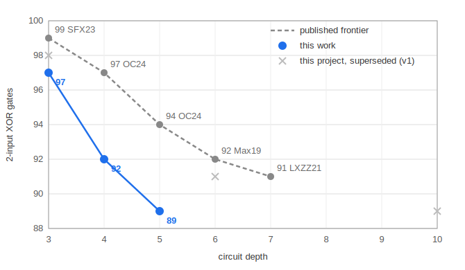
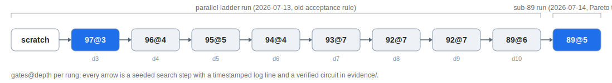

# slp-plateau-search

[](https://doi.org/10.5281/zenodo.21402996)
[](https://github.com/Joe-b-20/slp-plateau-search/actions/workflows/verify.yml)

The search method and evidence behind the record 2-input XOR circuits for AES
MixColumns: **97 gates at depth 3, 92 at depth 4, 89 at depth 5** — each
improving the published depth–count Pareto frontier (99 @ 3, Shi–Feng–Xu ToSC
2023; 97 @ 4 and 94 @ 5, Osvik–Canright ePrint 2024/1076; smallest published
count at any depth: 91, Lin et al. CT-RSA 2021).



The circuits themselves live in the artifact repository —
**[aes-mixcolumns-xor-circuits](https://github.com/Joe-b-20/aes-mixcolumns-xor-circuits)**
— as static, machine-checkable files with self-contained verifiers. This
repository is the other half: the **method** (a value-set shortest-linear-
program search with plateau and hub moves — see [`METHODS.md`](METHODS.md)),
the **pipeline** that ran it, and the **evidence** of the runs that produced
the records, archived untouched with their exact code and logs.

Everything is dependency-free Python 3 (stdlib only).

## Quickstart

Reproduce the records (all searches are stochastic — times are what the
archived and re-validation runs took, not guarantees):

```text
# 97 gates @ depth 3 -- from scratch, single core, single file; prints its
# progress live. Took 60-156 s across our runs (RNG seed 6); worst case it
# keeps restarting until it hits the 97 target or the 15 min budget:
cd reproduce && python3 reproduce.py

# 89 gates @ depth 5 -- the exact two-worker configuration of the sub-89
# run: warm-started from this project's 89@depth6 and 90@depth5 circuits,
# stops itself at the target. Took ~10 min in the archived run and ~13 min
# in a re-validation of this exact shipped setup:
cd pipeline && python3 ladder_parallel.py --mode fixed --stop-gates 89 --stop-depth 5

# 92 gates @ depth 4 -- the from-scratch cascade ladder (the archived run
# reached 92@4 after ~2.7 h; expect hours):
cd pipeline && python3 ladder_parallel.py --mode cascade --stop-gates 92 --stop-depth 4
```

Verify any circuit against MixColumns rebuilt from GF(2⁸) — pass a path to a
circuit JSON (`{"gates": [[a,b], ...]}` index pairs, signals 0..31 = inputs,
gate k → signal 32+k; run with no arguments for all accepted encodings), plus
an optional depth bound:

```text
python3 verify_circuit.py evidence/circuits/mixcolumns_89gates_depth5.json 5
python3 verify_circuit.py reproduce/out_97.json 3
```

## Layout

| path | what it is |
|---|---|
| [`METHODS.md`](METHODS.md) | the method: value-set representation, moves, engines, pipeline |
| `reproduce/` | single-command, single-core reproduction of the from-scratch depth-3 record (97 gates), plus opt-in legacy demonstrations of the moves with per-method seed provenance |
| `pipeline/` | the record hunter: coordinator (`ladder_parallel.py`), workers, engines, the two record-producing configurations, and the code-evolution history across the three record runs |
| `evidence/` | `RESULTS.md` (the records + full lineage) and the three record-producing run archives, untouched: logs, statuses, every verified best, and the exact `code/` that produced each |
| `verify_circuit.py` | standalone GF(2⁸) oracle: `python3 verify_circuit.py <circuit.json> [max_depth]` |

## The 89@depth5 lineage, from scratch



Full lineage tables for all three records — with the run-time and wall-clock
at which every step appeared — are in
[`evidence/RESULTS.md`](evidence/RESULTS.md).

## Verification chain

Nothing in this repository asks to be trusted. Every claimed circuit is a
JSON gate list; `verify_circuit.py` rebuilds the AES MixColumns specification
from the GF(2⁸) definition (FIPS 197, polynomial `0x11b`, column `[2,3,1,1]`)
and replays the circuit against it. The engines themselves never claim a
count — every candidate passes the oracle before it is saved or logged
(verify-before-claim), and the run archives in `evidence/` let you re-check
every intermediate best ever recorded.

## License / citation

MIT. If you use the method or the circuits, please cite this repository and
the artifact repository (see `CITATION.cff`). The accompanying note has been
submitted to the IACR Cryptology ePrint Archive and is awaiting moderation.
