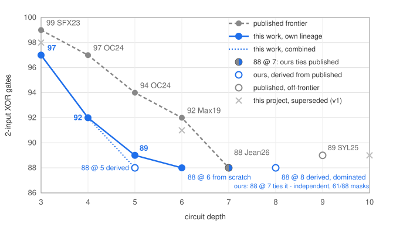
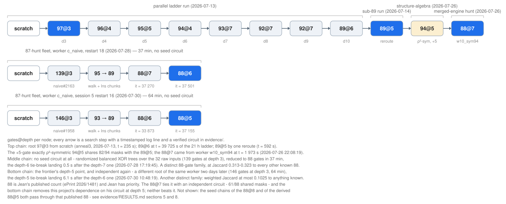

# slp-plateau-search

[](https://doi.org/10.5281/zenodo.21402996)
[](https://github.com/Joe-b-20/slp-plateau-search/actions/workflows/verify.yml)

The search method and evidence behind the record 2-input XOR circuits for AES
MixColumns: **97 gates at depth 3, 92 at depth 4, 89 at depth 5, and 88 at
depth 7**. The first three each improve the published depth–count Pareto
frontier at their depth (99 @ 3, Shi–Feng–Xu ToSC 2023; 97 @ 4 and 94 @ 5,
Osvik–Canright ePrint 2024/1076). The 88 takes this project's own record from
89 to 88 and reaches the published gate-count floor from a different direction:
it **matches the published 88 @ depth 7 (Jean, ePrint 2026/1481) with an
independent circuit** — the two share 61 of their 88 masks — rather than
beating it. Also published at unconstrained depth: 89 at unstated depth
(Sun–Yang–Li, ePrint 2025/1493). Neither of those points dominates the depth-5
89, so the depth-3, -4 and -5 circuits all remain on the frontier — see the
artifact repository's `PRIOR_ART.md`, including its Corrections section.

A fifth verified circuit, **88 @ depth 8**, is a third distinct 88-gate family
found by the same engine. It is dominated by the 88 @ depth 7, and its seed
chain passes through Jean's published circuit, so it is documented as a
distinct construction in [`evidence/RESULTS.md`](evidence/RESULTS.md) rather
than claimed as a record. **87 was not found**, and nothing here is claimed
optimal.



All five verified circuits are in `evidence/circuits/`, hash-pinned in
`evidence/circuits/spectrum.json`; all five also live in the artifact
repository —
**[aes-mixcolumns-xor-circuits](https://github.com/Joe-b-20/aes-mixcolumns-xor-circuits)**
— as static, machine-checkable files with self-contained verifiers. This
repository is the other half: the **method** (a value-set
shortest-linear-program search with plateau and hub moves — see
[`METHODS.md`](METHODS.md)),
the **pipeline** that ran it, and the **evidence** of the runs that produced
the records, archived untouched with their exact code and logs.

Everything is dependency-free Python 3 (stdlib only).

## Quickstart

Reproduce the records (all searches are stochastic — times are what the
archived and re-validation runs took, not guarantees):

```text
# 97 gates @ depth 3 -- from scratch, single core, single file; prints its
# progress live. Took 60-156 s across our runs (RNG seed 6), 81 s when
# re-validated on 2026-07-27; worst case it keeps restarting until it hits
# the 97 target or the 15 min budget:
cd reproduce && python3 reproduce.py

# 88 gates @ depth 7 -- one worker of the shipped pipeline on the record's
# own ρ²-symmetric 94-gate seed, stops itself at 88 @ depth <= 7. Reached a
# verified 88@7 in 19.4 and 31.0 minutes in two re-runs on 2026-07-27
# (32.9 min in the archived run):
cd reproduce && python3 hunt_88.py

# 89 gates @ depth 5 -- the exact two-worker configuration of the sub-89
# run: warm-started from this project's 89@depth6 and 90@depth5 circuits,
# stops itself at the target. Took 592 s (~10 min) in the archived run, with
# the v1 engine; the shipped v2 engine re-found it 0.3 s into the first
# chunk, the command returning in 19-22 s (re-validated 2026-07-27):
cd pipeline && python3 ladder_parallel.py --mode fixed --workers sub89 --stop-gates 89 --stop-depth 5

# 92 gates @ depth 4 -- the from-scratch cascade ladder (the archived run
# reached 92@4 after ~2.7 h; expect hours):
cd pipeline && python3 ladder_parallel.py --mode cascade --stop-gates 92 --stop-depth 4
```

The two 88-gate circuits came out of the campaign-87 engine rebuild. The
88 @ depth 7 re-runs from the single `hunt_88.py` command above — see
[`reproduce/README.md`](reproduce/README.md) for what does and does not
reproduce. The 88 @ depth 8 has no reproduction command on purpose: its seed
chain passes through Jean's published circuit. The lineage and the exact worker, seed, iteration and
wall-clock of each are in [`evidence/RESULTS.md`](evidence/RESULTS.md), and the
runs themselves are archived under `evidence/campaign87_run_*/` with their code.

Verify any circuit against MixColumns rebuilt from GF(2⁸) — pass a path to a
circuit JSON (`{"gates": [[a,b], ...]}` index pairs, signals 0..31 = inputs,
gate k → signal 32+k; run with no arguments for all accepted encodings), plus
an optional depth bound:

```text
python3 verify_circuit.py evidence/circuits/mixcolumns_89gates_depth5.json 5
python3 verify_circuit.py evidence/circuits/mixcolumns_88gates_depth7.json 7
python3 verify_circuit.py reproduce/out_97.json 3
```

## Layout

| path | what it is |
|---|---|
| [`METHODS.md`](METHODS.md) | the method: value-set representation, moves, engines, kernel, pipeline, exact neighbourhood certificates, symmetry, provenance |
| `reproduce/` | single-command reproductions: the from-scratch depth-3 record (97 gates, single core) and a single-worker re-run of the 88 @ depth 7 (`hunt_88.py`), plus opt-in legacy demonstrations of the moves with per-method seed provenance |
| `pipeline/` | the record hunter: coordinator (`ladder_parallel.py`), workers, engines, the record-producing configurations — including the `--workers hunt87` set that puts an uncapped worker on each of the three known 88-gate families — and the code-evolution history across the record runs |
| `evidence/` | `RESULTS.md` (the records + full lineage), `circuits/` (all five verified circuits, SHA-256 in `spectrum.json`), and the record-producing run archives, untouched: logs, statuses, every verified best, and the exact `code/` that produced each |
| `evidence/campaign87_run_2026-07-26_got_88at7/` | the run that found the 88 @ depth 7: `PROVENANCE.md`, the record and its ρ²-symmetric 94 seed, every worker's log and best, the diverse-88 portfolio, and the exact `code/` |
| `evidence/campaign87_run_2026-07-27_got_88at8_thirdfamily/` | the run that found the 88 @ depth 8: same shape, plus the third-family representatives and census references — and a `PROVENANCE.md` that states up front that this lineage passes through Jean's published circuit |
| `evidence/campaign87_certificates/` | `CERTIFICATES.md` and the machine-checked verdict summaries behind it: exhaustive k ≤ 3 shells for 47 canonical 88s, the population sweeps, the windowed-SAT runs (evidence, not proof), and the two exactly ρ²-symmetric 90-gate circuits |
| `evidence/campaign87_imported_prior_art/` | the published circuits, transcribed, oracle-verified and credited — **never ours**: Jean's 88 @ depth 7 (ePrint 2026/1481) and Sun–Yang–Li's 89 (ePrint 2025/1493) |
| `verify_circuit.py` | standalone GF(2⁸) oracle: `python3 verify_circuit.py <circuit.json> [max_depth]` |

## The lineage, from scratch to 88 @ depth 7



Full lineage tables for every record — with the run-time and wall-clock at
which every step appeared, and with the derived-work chain of the 88 @ depth 8
spelled out — are in [`evidence/RESULTS.md`](evidence/RESULTS.md).

## Verification chain

Nothing in this repository asks to be trusted. Every claimed circuit is a
JSON gate list; `verify_circuit.py` rebuilds the AES MixColumns specification
from the GF(2⁸) definition (FIPS 197, polynomial `0x11b`, column `[2,3,1,1]`)
and replays the circuit against it. The engines themselves never claim a
count — every candidate passes the oracle before it is saved or logged
(verify-before-claim), and the run archives in `evidence/` let you re-check
every intermediate best ever recorded.

The same discipline applies to provenance. Circuits from the literature are
kept apart from ours, credited by author and ePrint number, in
`evidence/campaign87_imported_prior_art/`; a result whose seed chain runs
through published work says so in its first sentence (the 88 @ depth 8). The
negative results are separated the same way: the exact window enumerations in
`evidence/campaign87_certificates/` are proofs for exactly the radius they
cover, while the windowed-SAT UNSATs are evidence only — they hold relative to
the encoding's fixed slot order. Nothing here bounds an 87-gate circuit away.

## License / citation

MIT. This is release **v2.0.0** (2026-07-27) — the release that adds the two
88-gate circuits, the rebuilt engine and the campaign-87 certificate archive to
the 97/92/89 records of the previous releases. If you use the method or the
circuits, please cite this repository and
the artifact repository (see `CITATION.cff`). The accompanying note is
published with the artifacts:
[`paper/mixcolumns_note.pdf`](https://github.com/Joe-b-20/aes-mixcolumns-xor-circuits/blob/main/paper/mixcolumns_note.pdf),
archived under DOI
[10.5281/zenodo.21299092](https://doi.org/10.5281/zenodo.21299092).
