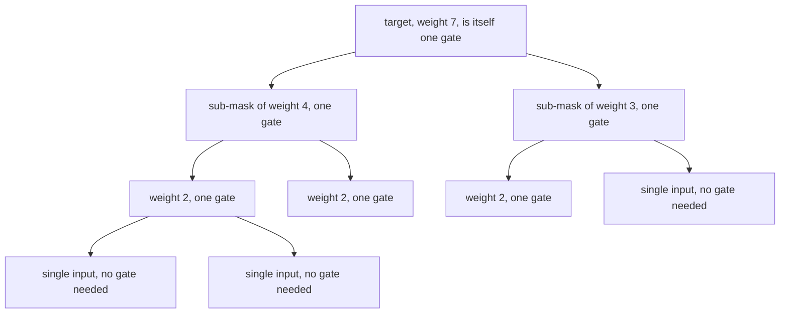
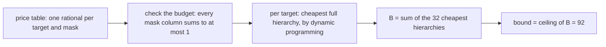

# How the cancellation-free bound works

[`STATEMENT.md`](STATEMENT.md) states the claim and proves it; [`RUN.md`](RUN.md)
gives the commands and the expected output. This file explains the mechanism:
what a price table is, why pricing proves a lower bound, exactly what the
checker asserts, and what the shipped code does *not* establish.

The claim is `92 <= L_cf(M) <= 102`, where `L_cf` counts gates in a
**cancellation-free** circuit — one in which the two operands of every gate
have disjoint input support, so no gate ever destroys a bit an earlier gate
produced. It is the only proved quantity in this project that lies *above* the
88-gate record: every circuit with at most 91 gates must cancel somewhere.

## 1. The one structural fact used

In a cancellation-free circuit, the gates that contribute to a target `t` form a
**full laminar hierarchy** over `t`'s support: `t` splits into two disjoint
sub-masks, each of those splits again, down to single inputs — and every
internal node of that tree, `t` itself included, is the mask of an actual gate.



That is the whole use of cancellation-freeness: with cancellation allowed, a
gate's mask need not be a subset of anything and the tree argument collapses.

## 2. The idea: charge each target for a whole hierarchy

Hand out **prices**. For every target `t` and every mask `m` inside `t`'s
support with weight ≥ 2, choose a non-negative rational `n[t][m]` — how much
target `t` is willing to pay for a gate carrying mask `m`. The prices obey one
constraint, and one only:

> **(C)** for every mask `m`: the sum of `n[t][m]` over all 32 targets is at
> most 1. *A gate is one gate however many targets want it.*

Three lines of arithmetic then give, for any cancellation-free circuit with gate
set `G`, that `|G| >= B`, where `B` is the sum over the 32 targets of the
cheapest full hierarchy under those prices — so `L_cf(M) >= ceil(B)`. The
derivation is in
[`STATEMENT.md`](STATEMENT.md#the-technique-a-laminar-price-certificate).

Nothing about how the price table was found enters the argument — that is what
makes the table a certificate. Any table satisfying (C) yields *some* bound; a
good table yields a large one.



The shipped table gives `B = 910019782 / 10⁷ = 91.0019782`, whose ceiling is 92.
The margin above 91 is small: 91.0019782 is the value a long optimisation run
reached, and it suffices, because the quantity being bounded is an integer.

## 3. Checking it: `check_cf_cert.py`

Stdlib only, 0.03 s, no solver. The certificate is a JSON file whose `prices`
field is a list of 32 dictionaries — one per target, keyed by **hex mask
strings**, valued by integer numerators over the shared `denominator` (10⁷).

| check | what it asserts |
|---|---|
| **A** (with `--aes-crosscheck`) | the matrix in `matrix.txt` really is AES MixColumns, rebuilt independently from GF(2⁸) and compared row for row |
| **T** | there are exactly as many price tables as targets (32) |
| **0** | every price is non-negative; every priced mask lies inside its own target's support; every priced mask has weight ≥ 2 |
| **1** | constraint (C): summed over targets, no mask's column exceeds the denominator. Reported as a ratio — the shipped tables reach exactly `1.0000000`, so the budget is fully spent |
| **2** | for each target, the cheapest full hierarchy, by dynamic programming over the ≤ 2⁷ = 128 subsets of its support: `g[S] = price(S) + min over unordered splits of g[S1] + g[S2]`, with singletons costing nothing. Summed into an exact integer numerator |
| **3** | the integer ceiling of that sum equals the `bound` field of the certificate |

Everything except the numbers in `prices` is recomputed: the target list comes
from `matrix.txt`, the hierarchies are re-minimised, the column sums are
re-accumulated, and the ceiling is integer arithmetic. The `numerator` and
`constant` fields in the file are decoration — the checker never reads them.

Two tables ship, from two independent derivations: `cert_cf92.json` from
subgradient ascent on the prices (~25 minutes to generate) and
`cert_cf92_sharper.json` from solving the price problem exactly as a linear
program and then exactifying it (`B = 91.4098776`). Both check in 0.03 s, both
give 92. Neither generator is in this directory; only the checkers are:
verifying must not need the solver stack that found the table.

## 4. The upper bound and its checker

`cf_102gates_depth5.json` is an explicit 102-gate cancellation-free circuit, so
`L_cf(M) <= 102`. Nothing about it is asserted in the file beyond the gate list;
`check_cancellation_free.py` computes all of it by replay:

```
signal[i] = 1 << i for the 32 inputs
for each gate (a, b):
    if support(a) AND support(b) is nonzero:  kappa += 1      <-- the test
    signal.append(support(a) XOR support(b))
    depth.append(max(depth[a], depth[b]) + 1)
```

So **"cancellation-free" is tested as `kappa == 0`**: the bitwise AND of the two
operand supports must be empty at every gate. Depth is measured as the longest
input-to-gate path, never read from the file, and the gate count is cross-checked
against any `gateCount` field. The measured verdict is 102 gates, 32/32 targets
built, `kappa = 0`, depth 5.

**Run the negative control too.** Point the same checker at the 88-gate record
circuit: 32/32 built, but `kappa = 22`, so it is valid and *not*
cancellation-free — it witnesses `L(M) <= 88` and says nothing about `L_cf`. A
checker that cannot return a negative verdict proves nothing, and this one
returns it on the record circuit. That verdict is also the substantive point: the
record lies four gates below the cancellation-free floor, so it *must* cancel,
and it does, 22 times.

## 5. What the checks cost, measured

- Both certificates: **0.03 s** each to check, one core. The 102-gate witness:
  **0.02 s**.
- 1 648 distinct priced masks; 1 960 and 1 934 priced (target, mask) pairs in
  the two tables; constraint (C) tight at exactly 1.0000000 in both.

Where the method stops is measured too: the optimum over this whole price family
is **`B* = 91.409884`**, and `L_cf >= 93` would need `B > 92`, so no price table
of this kind can prove 93. [`STATEMENT.md`](STATEMENT.md) gives that computation,
and the collision between this 102 and the unrestricted 102 in the literature.

## 6. Run it

From the `bounds/` directory:

```
python3 cf_gte92/check_cf_cert.py --aes-crosscheck
```

[`RUN.md`](RUN.md) gives the other three commands — the second certificate, the
102-gate witness, and the negative control on the 88-gate record — each with its
expected output and measured time.
