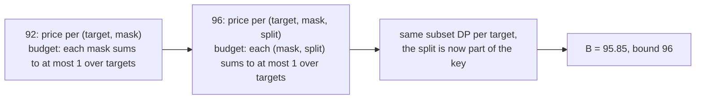

# How the 96 differs from the 92

[`../cf_gte92/HOW.md`](../cf_gte92/HOW.md) explains the mechanism shared by both packs: the
hierarchy lemma, price tables, why pricing proves a lower bound, and the cancellation-freeness
replay. This file covers only what is new.

## 1. One more coordinate in the key



A cancellation-free gate has exactly one parent pair, so it realises exactly one split of its
mask. A target's hierarchy therefore uses each internal mask with one specific split, and the
budget constraint only has to hold per (mask, split). That is a weaker constraint than "per
mask", so more price tables are feasible and the best of them is larger: the family optimum
moves from 91.41 to 95.85.

## 2. What the checker asserts (`check_split_cert.py`)

| check | what it asserts |
|---|---|
| **A** (with `--aes-crosscheck`) | `matrix.txt` is AES MixColumns, rebuilt from GF(2^8)/0x11B and compared row for row |
| **T** | one price table per target (32) |
| **0** | every key is `S:A` in hex with `S` inside its target's support, `|S| >= 2`, `A` a non-empty proper part of `S`; both spellings of a split are accepted and normalised; a split priced twice in one table is an error; every price is a non-negative JSON integer |
| **1** | constraint (C'): summed over targets, no (mask, split) column exceeds the denominator |
| **2** | per target, the cheapest full split hierarchy by DP over the subsets of its support, with unpriced splits costing 0; summed into an exact integer numerator |
| **3** | the integer ceiling equals the certificate's `bound` field (or `--expect`) |

Only the prices are read from the file. Targets come from `matrix.txt`, hierarchies are
re-minimised, column sums re-accumulated, the ceiling is integer arithmetic.

`check_split_cert_independent.py` is the referee's checker, written from the statement without
sight of the other one. It additionally brute-forces every full hierarchy of each target and
compares with the DP. Both must agree.

## 3. Run it

From `bounds/`:

```
python3 cf_gte96/check_split_cert.py --aes-crosscheck
```

[`RUN.md`](RUN.md) gives the other commands, the control on the embedded 92 table, the
independent checker, and their measured times.
