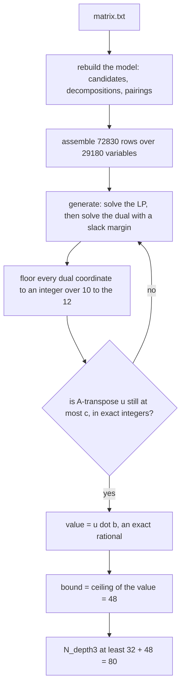
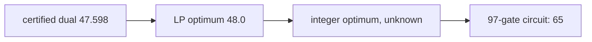

# How the depth-3 bound works

[`STATEMENT.md`](STATEMENT.md) is the argument and [`RUN.md`](RUN.md) the
transcript. This file adds the machinery a stranger needs in order to modify it:
the variable and row inventory of the linear program, how a dual vector becomes
a proved integer, and which parts are certified versus merely run.

Two different numbers live here, and the difference matters:

| claim | kind of evidence | check cost |
|---|---|---|
| `N_depth3 >= 80` | an exact rational dual certificate, re-checkable with the standard library alone | 0.29 s |
| `N_depth3 >= 81` | a branch-and-cut dual bound from a run that hit its time limit with a 66.89 % gap — valid, but not a certificate | not re-checkable |

## 1. The idea: depth 3 forces the circuit's shape

Every target row of the matrix has Hamming weight 5 or 7. A signal at level 2
is the XOR of two level-1 signals, each the XOR of two inputs, so it has weight
at most 4 — no target can appear before level 3. And a level-3 gate cannot feed
anything without exceeding depth 3. So a depth-3 circuit has **exactly 32
level-3 gates, one per target, all sinks**, and

```
N_depth3  =  32  +  min ( |L1| + |L2| )
```

where the minimum is over all ways of choosing intermediate signals such that
every target splits into two of them:

- `L1` — level-1 gates, i.e. masks of weight exactly 2 ("edges", a pair of
  inputs). There are 496 of them.
- `L2` — level-2 gates, i.e. masks of weight 3 or 4 (weight ≤ 2 is already
  available at level 1). A weight-4 mask is the XOR of two disjoint edges; a
  weight-3 mask is one input XOR a disjoint edge. **7 897** candidates: 4 889 of
  weight 4 and 3 008 of weight 3.
- A **decomposition** of a target is an unordered parent pair summing to it with
  both parts of weight ≤ 4. Weight-7 targets have 35 each — forced into a 4+3
  split inside their own support. Weight-5 targets also admit 1+4 and 2+3 splits
  inside the support, *and* 4+3 splits that overlap in one bit outside the
  target, which is what lets a part be shared with another target. **6 120** in
  total.

So the whole problem is a finite covering problem over 496 + 7 897 objects, and
the only remaining question is how few of them suffice.

## 2. The linear program

The exact model is 0/1; the certificate proves a bound on its **relaxation**,
which is a lower bound on the integer optimum. All coefficients are integers and
all rows are written `≥`. Variables are non-negative and **not** bounded above —
the relaxation is `min c·p` subject to `A p ≥ b`, `p ≥ 0`.

| block | count | meaning | cost |
|---|---|---|---|
| `x[e]` | 496 | edge `e` is built | 1 |
| `y[m]` | 7 897 | level-2 mask `m` is built | 1 |
| `z[t,k]` | 6 120 | target `t` uses decomposition `k` | 0 |
| `w[m,j]` | 14 667 | weight-4 mask `m` is assembled by its `j`-th pairing | 0 |

**29 180 variables.** The objective counts exactly the gates being paid for:
edges and level-2 masks. The exact-model rows:

| tag | rows | what it says |
|---|---|---|
| `cover` | 32 | each target uses at least one decomposition |
| `zparent` | 12 140 | if a target uses a decomposition, each of its non-input parents is built |
| `wbuild` | 4 889 | a built weight-4 mask uses at least one of its pairings |
| `wedge` | 29 334 | a used pairing implies both of its edges are built |
| `build3` | 3 008 | a built weight-3 mask implies one of its three sub-edges is built |

Then the **cuts** — extra inequalities that are theorems about depth-3 circuits,
so they cannot change the integer optimum and can only tighten the relaxation.
Each has its proof in the docstring of the function that generates it:

| tag | rows | the theorem |
|---|---|---|
| `C1` | 22 564 | a level-2 mask cannot be built without edges *inside* it, one per bit for weight 4 |
| `C3` | 32 | every target needs at least one level-2 parent; a weight-7 target needs two |
| `C4C5` | 768 | a weight-7 target forces a 3-edge matching inside its support, priced over every subset of it |
| `C6` | 40 | each weight-5 target needs an edge inside it, and two counting its boundary edges |
| `C7` / `C7b` | 1 / 2 | aggregate demand: summed over masks weighted by how many targets each can serve, at least 44 — and the same split by target weight |
| `C8` | 20 | per weight-5 target: edges inside it plus its overlapping decompositions, at least 2 |

**72 830 rows.** `cuts.py` also contains further families reachable only through
`mip3.py`'s `level` argument; the shipped certificate is level 1 and does not
use them.

## 3. From a dual vector to a proved integer

No solver is trusted, and strong duality is never invoked. Only weak duality:

> for any `u ≥ 0` with `Aᵀu ≤ c`, every feasible `p` has `c·p ≥ u·A·p ≥ u·b`.



The slack margin is the trick that makes flooring safe: the dual is solved with
`Aᵀu ≤ c - δ`, so rounding each coordinate *down* to a rational with denominator
10¹² keeps it dual-feasible. Several margins are tried and the first whose
rounding survives the exact check is kept.

The certificate `cert_depth3.json` is that vector: `denominator` 10¹²,
`u_nonzero` as 23 450 `[row index, integer numerator]` pairs, plus the resulting
`exact_dual_value_numerator` 47 597 998 171 620, `bound_L1L2` 48 and
`bound_N_depth3` 80.

Checking is `certify.py --check`, standard library only. It **rebuilds the
entire LP from `matrix.txt`** — re-deriving the targets, re-enumerating every
candidate, re-assembling all 72 830 rows and the cost vector — reads only the
denominator and the sparse dual vector from the file, verifies `u ≥ 0` and
`Aᵀu ≤ c` in Python integers, and recomputes `u·b` and its ceiling. The dual
vector is therefore a *claim under test*: a tampered one fails. (Two honest
gaps: the checker does not compare its recomputed value against the file's own
`bound_*` fields, and the *validity of each row* is taken from the generator's
code and its docstring proofs — which is what the controls below exist to test.)

## 4. Three positive controls, and why they are mandatory

A dual bound is only meaningful if every row is a genuine theorem. If one row is
wrong, the LP is not a relaxation and the bound can be arbitrarily large and
fake. So the shipped verified **97-gate depth-3 circuit** is mapped into the
model and must satisfy everything:

| control | what it maps in | what it rules out |
|---|---|---|
| `control_primal.py` | the circuit's level-1 and level-2 mask sets | the structure theorem or the candidate enumeration being wrong — it checks the level-3 masks are *exactly* the 32 targets, and that no level-1 or level-2 mask falls outside the candidate sets |
| `control_cuts.py` | the same two sets, against every cut | a cut not being a theorem: 23 405 cuts evaluated, 0 violated |
| `control_lp.py` | a full LP point, `z` and `w` included | any row at all being invalid: all 72 830 rows checked, none violated, objective 65 |

That last number also pins the chain from both ends:



Since `32 + 65 = 97`, the model demonstrably admits the real circuit — so the
bound cannot be an artefact of an over-constrained model.

## 5. Where this line stops

The certified number is 80 and cutting further does not raise it: the LP value
is exactly 48.0, so anything above 80 has to come from integer reasoning
rather than from more inequalities. That is what the `>= 81` run is — a HiGHS
branch-and-cut dual bound of 49 (`32 + 49 = 81`) after ~16.8 hours that never
left the root node and stopped with a 66.89 % gap. Valid; not a certificate; and
the shipped log was produced by a slightly looser model than the current
`mip3.py`, which now also caps the objective at 65 using the 97-gate circuit.

Bracket: `81 <= N_depth3 <= 97`.

## 6. Run it

From the `bounds/` directory. The check path is standard library only; only the
generation paths want numpy/scipy:

```
python3 depth3_gte81/certify.py --check depth3_gte81/cert_depth3.json   # 0.29 s
python3 depth3_gte81/control_primal.py                                  # 0.05 s
python3 depth3_gte81/control_cuts.py                                    # 0.12 s
python3 depth3_gte81/control_lp.py                                      # 0.31 s

python3 depth3_gte81/model3.py           # print the candidate counts
python3 depth3_gte81/certify.py          # regenerate a certificate (numpy + scipy)
python3 depth3_gte81/mip3.py [seconds]   # the branch-and-cut run (numpy + scipy)
```

Regeneration writes `cert_depth3_rerun.json` and never overwrites the shipped
certificate. [`RUN.md`](RUN.md) gives the expected output of each check.
