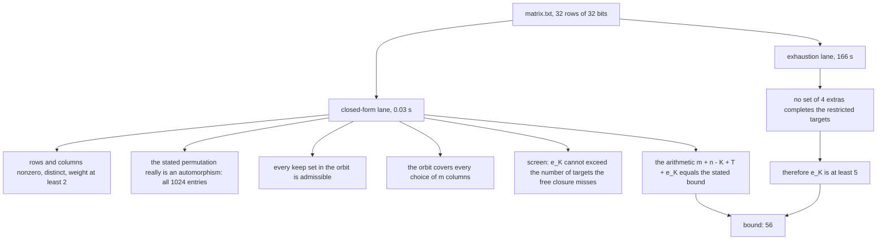
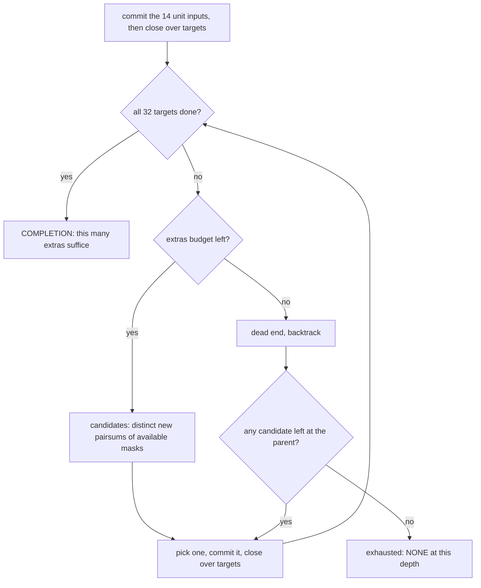

# How the `>= 56` bound works

[`STATEMENT.md`](STATEMENT.md) is the proof; [`RUN.md`](RUN.md) is the transcript
and the timings. This file explains the *machinery*: which parts are arithmetic,
which part is a search, how the search works, and what the checker does and does
not re-derive.

## 1. The idea in plain words

Count the gates any XOR circuit for the matrix must contain, from three
independent sources that cannot double-count each other:

- **One gate per output.** Every one of the 32 target rows has Hamming weight
  ≥ 2, so each is the mask of some gate, and no two are the same mask. That is
  `T = 32` gates, with no further argument.
- **One gate per live input outside the keep set.** Pick a set `K` of input
  columns and suppose an adversary supplies, at no cost, every gate that touches
  only those columns. Each *live* column outside `K` still has to be mixed in at
  least once, costing `n - |K|` further gates. (This is where the preconditions
  matter: a column that is all zeros needs no gate at all, so the charge is only
  valid on nonzero columns — see [`../validation/`](../validation/), which
  contains a matrix that breaks exactly this step.)
- **The extras you still cannot avoid.** Even with those gates supplied, the 32
  targets restricted to `K` cannot all be assembled from each other: you need
  `e_K` extra intermediate masks. This is the only term that requires search.

A fixed `K` would be a weak choice, because an adversary can concentrate all the
sharing on the columns you gave away. So the argument uses a *family* of keep
sets — the orbit of one `K` under a permutation that is an automorphism of the
matrix — together with the fact that every choice of `m` columns is missed by at
least one member of the family. That costs `m` gates and gives the minimum over
the whole family.

```
L(M)  >=   m   +   (n - |K|)   +      T       +     e_K
       =   1   +   (32 - 14)   +      32      +      5     =  56
           ^        ^                  ^                ^
      level of   live columns      one gate per     extras that
      the family  outside K        target row      cannot be avoided
```

Both bracket ends: `56 <= L(M) <= 88`, the upper end being the best known
circuit. Thirty-two of the 56 need no argument; the proof establishes 24 of the
record's 56 middle gates.

## 2. Two lanes: one is arithmetic, one is a 166 s search



Everything in the left lane is a finite predicate over the matrix, re-checked
from `matrix.txt` in a fraction of a second by `check_gte56.py` (sections A–G,
plus a positive control G that replays a recorded witness on a keep set that
*does* fail, and requires the same set to fail without it). The right lane is
the one that costs compute, and the shipped default is to **cite** it rather
than re-run it — `check_gte56.py` prints `e_K = 5` as a documented exhaustion
and says so. `--minE-depth 4` re-runs it.

## 3. The exhaustion: `mine.c`

**The question.** Fix the keep set `K` (`k = |K| = 14` bits) and the list of 32
target masks restricted to those columns. A set of masks `G` containing all the
targets is *realizable* if it can be ordered so that every element is either a
unit input or the XOR of two strictly earlier elements. Define
`minE = min |G \ targets|` — the fewest extra, non-target masks any realizable
`G` needs. Then `e_K = minE`, and proving `minE >= d+1` means **exhausting every
way of using `d` or fewer extras**.

**The state** is the set of masks committed so far (`avail`, with a bitmap for
O(1) membership) plus which targets are done. It is kept *target-closed*: after
every commit, the code repeatedly commits any not-yet-done target that is now
the XOR of two available masks. That is without loss of generality — a
realizable `G` contains every target anyway, so committing a derivable target
early only enlarges `avail`, which can never destroy a later derivation.

**The move** is "add one extra mask", and the candidates are exactly the
distinct nonzero pairwise XORs of currently available masks that are not already
available. That is complete: the next non-target element of a realizable
ordering has to be a pairsum of what is available at that point.



So it is a depth-limited DFS with backtracking over target-closed available
sets, not a BFS and not a DP; there is no memoisation. `NONE` at depth `d` means
`minE >= d+1` — a fact about the whole tree, not a timeout.

Two prunings, both off unless asked for on the command line, both argued sound
in the header comment of `mine.c` (and *only* there):

| flag | what it prunes | why it is sound |
|---|---|---|
| `-p` | at the last remaining extra, only candidates of the form `target ^ available` are tried | the final extra must itself start the cascade that finishes some target |
| `-o` | a child skips a candidate smaller than the extra just chosen if that candidate was already addable in the parent | that branch is a reordering of one explored elsewhere; saves up to a factor `d!` |

`-s shard -n nshards` splits the *root* branches only, which is how the
historical run was distributed across 114 shards. `-w` is a debugging aid: on a
find it prints the witness extras alongside the verdict. It changes nothing
about the search and no result here depends on it.

The searcher takes no other input: `k`, a comma-separated target list and a
depth on the command line. It prints one line to stdout and knows nothing about
the matrix, the keep set, the permutation or the bound. It never reads or writes
a file. `check_gte56.py` is the only thing that knows the theorem, and it talks
to the searcher by argv and stdout.

```
k=14 depth=4 jam=8 shard=0/1 nodes=1895523772 result=NONE
```

`jam` is how many targets are still unreached after the free closure of the
units alone — the closed-form screen from lane A, printed so you can see that the
searcher started from the state the checker expected. Node counts are
deterministic, so they double as a reproduction fingerprint.

## 4. What is re-verified, and what is taken on trust

| | |
|---|---|
| re-derived from `matrix.txt` by the checker | every term of the bound except `e_K`; the automorphism, entry by entry; admissibility of every keep set in the orbit; the covering hypothesis; the jam screen; the arithmetic; the witness replay |
| a *claim under test*, not trusted input | the keep set and the permutation in the certificate — a wrong one fails a section |
| cited, not re-derived, unless you pass `--minE-depth 4` | `e_K = 5` |
| taken on trust | the theorem itself, which is a paper proof in `STATEMENT.md`, not machine-checked; the soundness of `-p` and `-o`, argued in `mine.c`'s header; that the `mine` binary on disk was built from `mine.c` (the checker only tests that it exists) |

One honest detail about the in-band re-run: `--minE-depth 3` establishes
`e_K >= 4`, which re-derives 55, not 56, and the script says so; only
`--minE-depth 4` re-derives the shipped number. And the re-run always uses both
prunings, whereas the historical `9.43e10`-node run used none — which is what
made that result prune-independent. It is cited, not reproduced.

## 5. Measured cost, and where the method stops

- The closed-form lane: **0.03 s** warm, **0.11 s** cold, one core (2026-09-01).
- The exhaustion at depth 3: **5 784 927 nodes**, ~0.5 s. At depth 4:
  **1 895 523 772 nodes**, **166.0 s** and **156.8 s** on two runs, one core.
  Node counts identical across runs.
- Historically: 16 workers, 114 shards, run to completion **twice** by
  independent implementations — 9.43e10 nodes unpruned in C and 4.75e9 nodes
  pruned in Python — no completion on any of the 511 root branches, both
  agreeing on the identical root state.
- The bound is a **whole-matrix** method, not MixColumns-specific: the checker
  and the searcher both take an arbitrary 0/1 matrix, which is what
  `../validation/` exploits.
- Where it stops: the next rung (`e_K >= 6`, giving 57) is estimated at ~500×
  the depth-4 cost. Of twelve keep-set certificates of this size tested at depth
  4, eleven have `e_K = 4` exactly, with explicit witnesses; this one is the
  survivor.

## 6. Run it

From the `bounds/` directory:

```
cc -O2 -o gte56/mine gte56/mine.c            # once

python3 gte56/check_gte56.py                 # closed-form checks, e_K cited
python3 gte56/check_gte56.py --minE-depth 4  # + re-run the exhaustion (166 s)

gte56/mine 14 <t0,t1,...,t31> 4 -p -o        # the raw searcher, any instance
```

[`RUN.md`](RUN.md) gives the expected transcript of the two checks and the
measured times. `check_gte56.py` also takes `--matrix`, `--cert` and `--mine`, to
point the same machinery at another matrix or another certificate.
