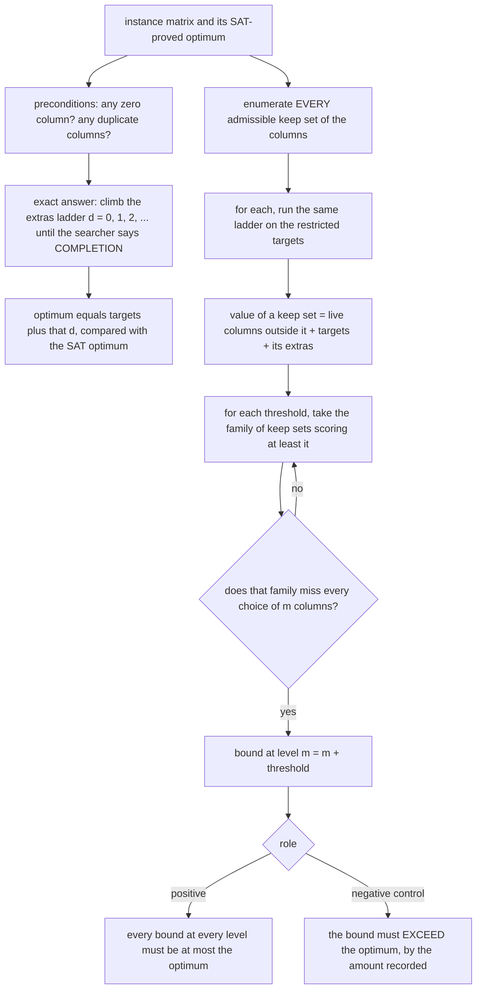

# How the validation suite works

`STATEMENT.md` says why this directory exists and what it caught; `RUN.md` gives
the command and the transcript. This file explains the mechanism: what is
enumerated, how the exact optimum of a small instance is obtained, and what each
assertion would catch.

## 1. The idea in plain words

A lower-bound method is only worth reading if it **cannot return a number above
the truth**. That is not something you can inspect; you have to try to break it.
So the machinery of `../gte56/` — the same formula and the *same compiled
binary*, not a reimplementation — is run on small matrices whose exact optimum
was proved by a completely unrelated method (iterated SAT, with the level below
the optimum recorded UNSAT), and every bound it produces is compared against
that optimum.

Three instances ship, and one of them is designed to fail:

| instance | role | columns | targets | known optimum |
|---|---|---|---|---|
| `L1_clean_iso` | positive | 8 | 4 | 12 |
| `L5_tap_pairQ3` | positive | 7 | 4 | 10 |
| `tap_P__Q1_2_4_a` | precondition negative control | 8 | 4 | 10 |

They are MixColumns-derived blocks re-expressed in their own input basis, not
random matrices, so they exercise the machinery on the kind of structure it is
aimed at.

## 2. What the suite computes for each instance



Three mechanisms are worth naming precisely.

**The exact optimum, from the same searcher.** For `d = 0, 1, 2, …` the suite
invokes `mine` on the instance's full target list at depth `d` and returns the
first `d` that reports `COMPLETION`. That `d` is exactly the minimum number of
extra masks, so the optimum is `targets + d`. This works because in a minimum
XOR straight-line program no gate mask repeats and every target of weight ≥ 2 is
itself a gate mask, so the gate set is exactly the targets plus the extras.
Since the SAT optima came from unrelated code, agreement here is a genuine
cross-check of two independent paths, not a self-consistency test.

**The full bound table, by brute force.** Every subset of the columns of size
2..n is enumerated, filtered to the admissible ones, and priced by the same
ladder. This is why the suite only handles 7–8 column instances: the table is
exponential in the number of columns and every cell is a subprocess ladder.

**The best covering family, by descending threshold.** Distinct table values are
walked from the top; at each threshold the family of keep sets scoring at least
that much is tested for whether it misses every `m`-subset of columns. The first
threshold that covers gives the bound `m + threshold`, and it is the maximum
because the family only grows as the threshold falls. The suite reports this at
levels `m = 0, 1, 2`, and then repeats the `m = 1` computation with the table
restricted to keep sets of size at most a cap, for every cap — which shows how
much of the bound is bought by being allowed large keep sets.

## 3. The negative control, and the thing it caught

`tap_P__Q1_2_4_a` has an entirely **zero column**. The formula charges at least
one gate for every column outside the keep set, but that charge is only valid on
a *live* column: a column that is all zeros costs nothing to zero. Skip that
precondition and the machinery returns **11 against a true optimum of 10** —
at every level, and at every keep-set cap of 6 or more. Drop the zero column and
all bounds come back sound at 10.

That is why `../gte56/check_gte56.py` tests columns for being nonzero and
pairwise distinct *first*, and why this instance is in the suite: it makes the
precondition visible rather than decorative. On MixColumns all 32 columns are
nonzero and distinct, so `>= 56` is unaffected.

The suite's role dispatch enforces the whole story: a positive instance must
pass its preconditions and produce only sound bounds; the control must **fail**
its preconditions, must overclaim by the exact recorded amount, and must become
sound once reduced. Exit status is 0 only if every one of those holds.

## 4. What it established, measured

- Whole suite: **170.5 s** and **156.2 s** on two runs (2026-09-01, one core,
  `nice -n 19`), identical verdicts and identical node counts both times.
  Almost all of it is one deep exhaustion (2.7e9 nodes); the other two
  instances together take **0.4 s**.
- **Agreement:** the searcher reproduced all three SAT optima exactly —
  `4 + 8 = 12`, `4 + 6 = 10`, `4 + 6 = 10`.
- **Soundness:** no bound above a known optimum on either clean instance, at any
  level or cap. On both, the level-1 bound is exactly *tight* — 12 against 12
  and 10 against 10 — once the keep set is allowed to be large enough, which is
  evidence that the formula is not merely safe but sharp on this kind of
  instance.
- **The slack table**, which is the honest limitation: on the 8-column instance
  the level-1 bound is 10, 10, 11, 12, 12 at keep-set caps 3, 5, 6, 7, 8. Small
  keep sets lose two gates. On MixColumns the certificate uses a keep set of 14
  of 32 columns, i.e. it is deep in the region where the bound is not yet tight.
- The SAT oracle that supplied the optima has its own recorded controls: exact
  agreement against a naive brute-force enumeration on small random instances
  (both the SAT and the UNSAT side), a second independent CNF implementation
  agreeing 10/10 on an unrelated block set, and one real bug caught this way in
  an earlier searcher (8 failures in 120 instances, since fixed).

## 5. Run it

From the `bounds/` directory:

```
cc -O2 -o gte56/mine gte56/mine.c                              # once

python3 validation/run_validation.py                            # ~160 s
python3 validation/run_validation.py --instance L5_tap_pairQ3   # 0.2 s
```

The short form exercises every code path except the deep exhaustion, which makes
it the right smoke test after changing anything in `../gte56/`. Also accepted:
`--mine PATH` and `--max-depth D`.
