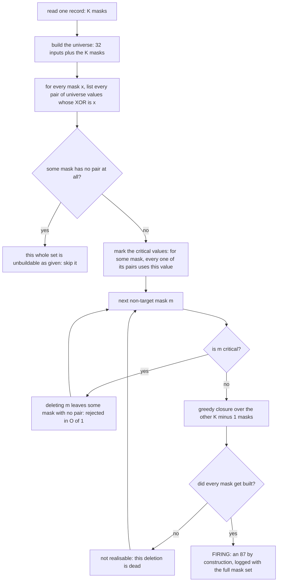

# How the deletion certificate works

`CERT.md` states the result and its scope; `RUN.md` is the re-run recipe. This
file explains the tool: what question is asked of each circuit, how the fast C
test is the same test as the reference Python one, the file formats, and how
shards become one verdict.

## 1. The question, per gate

A circuit here is identified by its **value set**: the set of 32-bit masks its
gates compute, one mask per gate (mask bit `c` set means "this signal depends on
input `c`"). For a known 88-gate circuit that is 88 masks, 32 of which are the
MixColumns targets.

For each of the 56 **non-target** masks `m` in a set, ask:

> Can the remaining 87 masks still be built from the 32 inputs at all — with
> the wiring thrown away and re-planned freely?

If yes for even one `m`, that set yields an 87-gate circuit by deletion. The
certificate is that the answer was **no**, every time, for every non-target mask
of every set in the population: 1 575 516 distinct value sets × 56 = **88 228 896
deletions, 0 realisable.**

"Realisable" is defined constructively, not by searching orderings: start with
the 32 input masks available, and repeatedly add any mask of the set that equals
the XOR of two already-available values, until nothing more can be added. If
every remaining mask gets added, the set is realisable, and the order in which
they were added *is* a legal circuit. Because the closure is a least fixpoint,
no build order can succeed where it fails — which is why this tests the value
set rather than one wiring of it.

## 2. The two-stage test

The cheap first stage is the reason the whole population is affordable. For each
mask `x` in the set, intersect the endpoint sets of all of `x`'s derivation
pairs; the intersection has at most two elements, and any value in it is
*critical* — delete it and `x` becomes underivable, so the closure cannot
possibly succeed. Critical deletions are rejected without running the closure at
all. **35 323 820 of the 88 228 896 deletions (40 %) survived the filter** and
were decided by full closure.

The pair lists are built **once per set** over the full universe including `m`,
and reused for all 56 tests. That is sound because the closure never marks `m`
as available, so any pair mentioning `m` can never be satisfied — the reused
table behaves exactly like one rebuilt without `m`.

## 3. Why the fast tool is trusted

Two independent implementations of the same test ship: the C tool
(`tools/delcert.c`, 64-bit-word availability bitsets, a compacted worklist, a
small hash table for value lookup) and a reference in Python
(`tools/pycheck.py`, plain sets, no bit tricks, targets recomputed from GF(2⁸)
rather than read from a file). They are run over the same 520-set shipped sample
and must report identical `tested`, `local_pass` and `realisable` counts.

One deliberate asymmetry: the C tool reads its 32 target masks from
`targets.txt` and only checks that there are exactly 32 of them, so for the C
tool the target set is *data*. The Python reference rebuilds them from the field
spec. Agreement between the two is therefore also a check on that file.

## 4. Controls: the tool must be able to say yes

A count of zero is evidence only if the tool can also return a nonzero count, so
three fixture populations ship, each 498 records:

| fixture | what it is | required outcome |
|---|---|---|
| `ctrl_neg498.bin` | 498 real 88-gate value sets | 27 888 tested, 0 realisable |
| `ctrl_pos89.bin` | the same 498 sets, each with **one** extra mask planted that is the XOR of two of its own values | 28 386 tested, **498 firings** — one per record |
| `ctrl_pos90.bin` | the same, with two extras planted | 28 884 tested, **996 firings** |

The planted extra is redundant by construction, so deleting it must leave a
realisable set. If the positive fixtures do not fire, the tool is broken.

## 5. File formats

| file | layout |
|---|---|
| `masks.bin`, `fixtures/*.bin`, `../sample/corpus88_sample.bin` | headerless flat array of records; one record = `K` little-endian `uint32` masks sorted ascending, so the stride is `4·K` bytes (352 at `K = 88`). `K` is not in the file — it is passed as `--k`, and the record count is the file size divided by the stride |
| `targets.txt` | 32 lowercase 8-hex-digit masks, whitespace-separated |
| `canon.tsv` | `canon`, source, path — one line per record, in the same order as `masks.bin`, so the two join positionally |
| shard `.jsonl` | three line kinds, appended as the run proceeds: a progress line every `--every` records; one `{"DONE":1,…}` line per finished interval carrying the counters; and a `{"FIRING":1,…}` line per realisable deletion, with the record index, the deleted mask and the full mask set |

`canon = sha256` of the comma-joined sorted hex masks, truncated to 16 hex
digits — an order-free identity for a value set. Two circuits with the same
`canon` compute the same values however they were built, which is why the
population is counted in **distinct value sets**, not circuits.

## 6. From shards to one verdict

The population is split into intervals by `--start` / `--count`, each shard
appending to its own `.jsonl`. `tools/aggregate.py` then reads the shard files,
sums the counters, collects any firing, and — the part that matters — sorts the
`DONE` intervals and sweeps them to prove they **tile `[0, N)` with no gap and
no overlap**. Coverage is thereby a checked property of the logs, not a claim.
Exit status is nonzero if a gap or an overlap exists.

## 7. The command-line interface

The commands, their real output and their measured cost are in
[`RUN.md`](RUN.md); the full-run cost is in [`CERT.md`](CERT.md) §5. This
section documents only the interface.

Flags: `--bin` and `--targets` are required; `--k` is the masks per record
(default 88); `--start` / `--count` select an interval; `--every N` sets the
progress cadence (`0` = only the final line); `--out FILE` appends the JSONL
instead of writing to stdout; `--tag` labels the lines. Exit 2 means bad
arguments or a target file that is not 32 masks; exit 3 means a record needed
more derivation pairs per mask than the fixed table holds.

Running the full population needs `masks.bin`, which is 554 MB of built
population and is not shipped; [`../../INVENTORY.md`](../../INVENTORY.md) says
how to request it. The 520-set sample and the three fixtures make every code path
runnable here in under a second.
