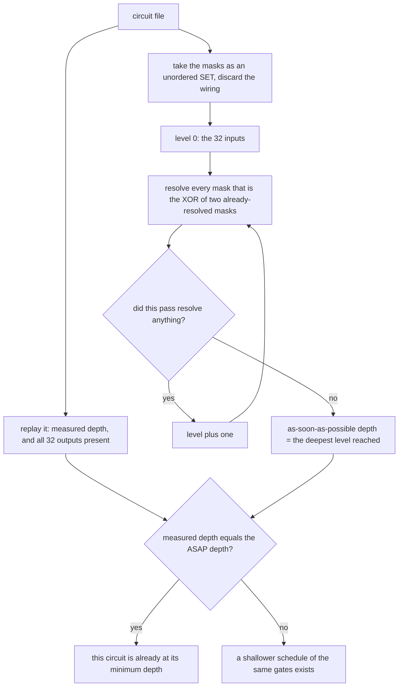

# How the depth check works

`DEPTH_FORCED.md` states the claims. This file explains the one mechanism behind
the re-runnable one: how the *minimum possible* depth of a circuit is computed
from its value set, and why that number cannot be beaten by rescheduling.

## 1. The idea

Depth is usually thought of as a property of the wiring — the same gates,
scheduled differently, ought to give a different depth. For these circuits it is
not: depth is a property of the **set of values** the circuit computes.

Take a circuit's masks as an unordered set, throw the wiring away, and ask the
cheapest question you can: *using only masks from this set, how few XOR levels
does each mask need?* Inputs are at level 0. A mask is at level `d` if it is the
XOR of two masks whose levels are both below `d`, and `d` is the smallest such
number. Computing that for every mask is a **least fixpoint**, so it is the
best any schedule could do — the "as soon as possible" depth of the set.

Compare that to the depth the circuit actually has. If they are equal, the
circuit is already as shallow as its own value set permits, and no rescheduling
of those gates can do better. That is the check, and all nine shipped circuits
pass it.



The fixpoint is computed level by level — each unresolved mask is tested only
against the masks that were resolved on the previous level, rather than against
the whole set on every pass — which is what makes it fast enough to run on every
circuit in a fraction of a second. On a value set containing a repeated mask the
level frontier is not well defined, and the code falls back to the original
all-pairs fixpoint, which computes the same result more slowly.

The script also reports, per circuit, the histogram of how many masks sit at
each level and which output rows are pinned at the deepest level. Those are the
gates that would have to move for the circuit to get shallower, and they are why
the answer is "none of them can".

## 2. What it establishes, and what it does not

**It establishes**: every shipped circuit — 88, 89, 91, 92 and 97 gates — is
already at the shallowest depth its own mask set admits. Consequence: you cannot
take a cheap 88 found at some large depth and reschedule it down to the record
depth. Depth records need a different value set, not a cleverer schedule.

**It does not establish** anything about value sets nobody has: a *different*
88-mask set could well be shallower. The claim is per circuit, and the
population it covers is the shipped one.

The measured/ASAP agreement also has a corollary the companion document leans
on: since the wiring is recoverable from the value set and the depth is forced by
it, a mask set is the honest identity of one of these circuits — which is the
convention the rest of `corpus/` uses.

## 3. Run it

From the repository root (the script imports the search engine's depth kernel
and reads the shipped circuits):

```
python3 corpus/depth_forced/asap_depth.py
```

It prints one row per circuit — measured depth, ASAP depth, the level histogram,
and the pinned output rows — and exits nonzero if any circuit could be
scheduled shallower. Runtime is a fraction of a second for all nine.
