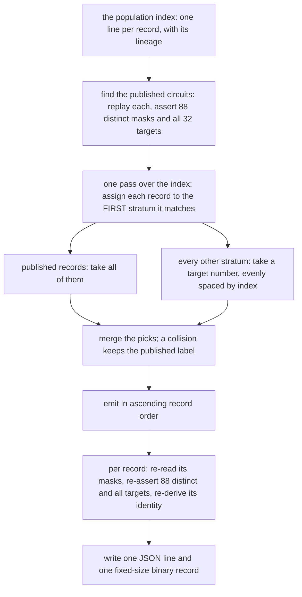

# How the sample was built

`RUN.md` shows how to check the shipped sample and what its strata are. This
file explains the builder: how 520 records were chosen out of 1 575 516, why the
draw uses no randomness, and the exact byte layout of the two files — the layout
the certificate tool in `../deletion_certificate/` reads.

## 1. Why a sample exists

The full population is not shipped: 554 MB of raw values, with a 457 MB
provenance index ([`../../INVENTORY.md`](../../INVENTORY.md)). The claim it supports —
"0 realisable deletions" — is only meaningful if a reader can run the same tool
over the same kind of data, so a 520-record sample ships instead. It is drawn to
be **representative and auditable**: every distinct lineage in the population is
present in proportion, and all five published 88-gate circuits are included, so
the sample contains the value sets a reader is most likely to check by hand.

## 2. The draw

Three properties of that procedure are what make the sample checkable:

- **No RNG.** Within a stratum of `N` records wanting `n`, the builder takes
  indices `int(j · N/n)` for `j = 0 … n-1` — evenly spaced through the stratum in
  index order. The same inputs give the same 520 records forever, so the sample
  is a function of the population, not of a seed.
- **First match wins.** A record belongs to the first stratum whose predicate it
  satisfies, so the strata are a genuine partition and the order in which they
  are listed is part of the definition.
- **Collisions are visible, not silenced.** A published record that also falls in
  another stratum keeps its published label, which is why one stratum in the
  shipped composition table holds 59 records rather than the 60 it asked for.
  `RUN.md` states that, rather than rounding the table.

Every record is re-validated on the way out: 88 masks, all distinct, all 32
targets present, and its recomputed identity equal to the one the index recorded.

## 3. The two files, exactly

| file | layout |
|---|---|
| `corpus88_sample.jsonl` | one JSON object per record: identity, source, lineage, `n_masks_distinct`, `n_targets_present`, and the 88 masks as sorted hex strings; the five published rows also name their circuit file |
| `corpus88_sample.bin` | **no header, no delimiters**: one record = 88 little-endian `uint32` masks, sorted ascending = **352 bytes**, records in the same order as the JSONL lines. The shipped file is 183 040 bytes = 520 × 352 |

The identity is
`sha256(",".join("%08x" % m for m in sorted(masks)))[:16]` — an order-free name
for a value set, so two circuits computing the same values have the same
identity however they were built.

The binary layout is not incidental: it is exactly what `delcert --k 88` reads,
which is why the sample can be fed straight to the certificate tool and to its
Python reference. `SAMPLE.sha256` pins both files plus the size and hash of the
full index they were drawn from.

## 4. The checker

`tools/check_sample.py` re-derives the 32 target masks from GF(2⁸), asserts
their weight profile, then walks the JSONL and the binary **in lockstep**: for
each row it re-checks the 88 masks, their distinctness, the presence of all 32
targets, the identity, that no identity repeats, and that the next 352 bytes of
the binary equal the row's sorted masks. After the last row it asserts the
binary holds no extra bytes. A failing row is counted rather than fatal, so one
run reports every problem; exit status is nonzero if any row failed.

## 5. Running it

The checker's command, its real output and its measured cost are in
[`RUN.md`](RUN.md), together with the rebuild command — rebuilding the sample
needs the full population and its index, which are not shipped. Feeding the
same `corpus88_sample.bin` to the certificate tool and to its Python reference
is in [`../deletion_certificate/RUN.md`](../deletion_certificate/RUN.md).
