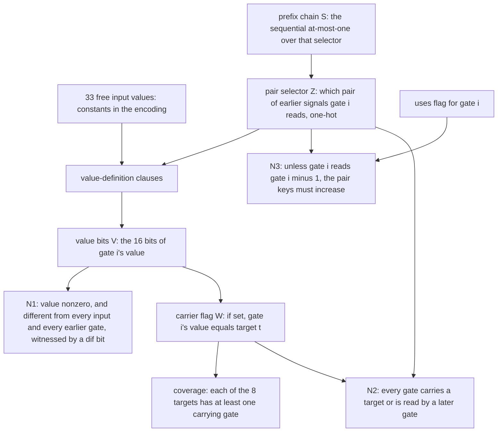
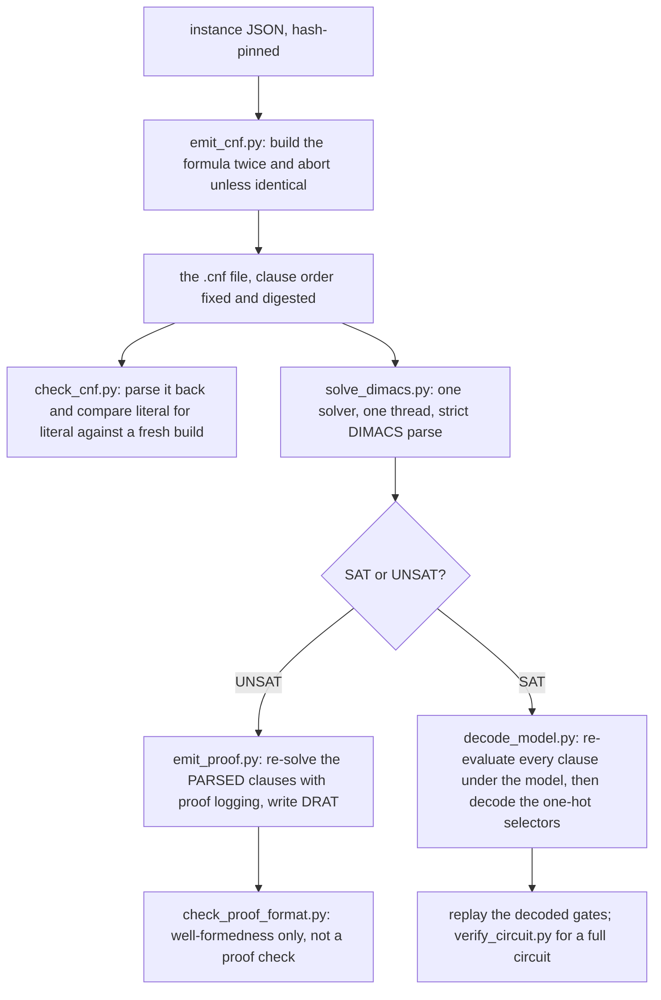

# How the SAT encoding works

`STATEMENT.md` states what was proved and why it matters; `RUN.md` is the
step-by-step transcript; `gen_and_solve.md` covers solver mechanics. This file
explains the encoding itself — what the variables are, what each group of
clauses says, how the search space is legitimately restricted, and what is
deliberately *not* encoded.

## 1. The question one file asks

Each shipped `.cnf` asks one decision problem:

> Is there a straight-line program of **exactly `k` two-input XOR gates** over
> this instance's supply of signals whose signal set contains all 8 target
> values — in the normal form (N1)–(N3) below?

SAT means such a program exists and can be decoded from the model; UNSAT means
none does. There is **one file per `k`** and no "at most `k`" encoding, for a
reason given in §4: the normal form is not monotone in `k`.

The instance is one merged subproblem: 4 of the 32 output groups, a supply of
**33** free signals, **8** targets, working in a 16-dimensional coordinate
space. It brackets at ≤ 15 gates constructively and ≥ 9 by a counting bound, and
`k = 14` is the decisive level: a 14 would mean the surrounding decomposition
over-charges by one gate, which is the difference between 88 and 87.

Before any clause is written, the instance is **normalised**: inputs are reduced
to a basis of their span and everything is recoded into coordinates over that
basis, duplicate and zero inputs are dropped, and targets already equal to an
input are removed. So the value variables below live in those 16 recoded
coordinates, not in the original output-bit numbering.

## 2. Variables and clauses

Signals are numbered `0 … m-1` for the free inputs and `m+i` for the output of
gate `i`.

| family | shape | what one variable means |
|---|---|---|
| `V[i][b]` | `k × 16` | bit `b` of the value carried by gate `i` |
| `Z[i][j]` | one block per gate, `j` over all pairs of earlier signals | gate `i` reads signal pair number `j` — one-hot |
| `S[i][j]` | same shape as `Z[i]` | prefix marker of the sequential at-most-one chain over `Z[i]` |
| `dif[…]` | 16 bits per ordered gate pair | witness bit where two gates' values differ |
| `uses[i]` | one per gate after the first | gate `i` reads the output of gate `i-1` |
| `W[t][i]` | `8 × k` | gate `i` carries target `t` |

At `k = 14` that is **23 323 variables and 285 480 clauses**.



The groups, with their clause counts at `k = 14`:

| group | clauses | what it enforces |
|---|---|---|
| pair selection | 14 + 32 249 | each gate reads at least one pair, and the sequential chain forbids two — exactly one |
| value definition | 237 664 | if gate `i` reads pair `(p,q)` then each bit of `V[i]` is the XOR of that bit of the two operands; specialised down to 1, 2 or 4 clauses per bit when an operand bit is a constant |
| (N1) distinctness | 14 + 462 + 3 003 | the value is nonzero, differs from all 33 input values, and differs from every earlier gate's value in at least one `dif` bit |
| (N3) ordering | 10 244 | defines `uses[i]`, and forces the pair key to increase across independent adjacent gates |
| target coverage | 8 + 1 792 | at least one carrying gate per target, and a carrying gate's value equals the target |
| (N2) no dead gate | 14 | every gate carries a target or appears in some later gate's pair |
| (L1) target positions | 16 | a target at distance `d` cannot be carried by a gate before position `d` |

Value definition is ~83 % of the file, which is what you would expect: it is the
only group that talks about all 16 bits of every gate.

Two encoding choices worth stating because they look like bugs and are not.
`W` is one-directional (`W → V`, never the converse): the at-least-one clause
forces a genuine carrier, and any real program can set `W` accordingly, so the
encoding stays faithful. And the optional cone-pruning clauses on `V` — a
logical *consequence* of the rest, added only because unit-propagating them is
cheap — are governed by a clause budget; at this instance's size the first gate
alone exceeds the budget, so the encoder skips them. That prunes less and proves
the same thing.

## 3. What restricts the search, and why it is sound

Each of these is proved in the encoder's module docstring, and all of them
switch off with `--no-symmetry`:

| rule | what it forbids | soundness |
|---|---|---|
| (N1) | two signals with the same value, or a zero value | if a gate repeats an earlier value, rewire its users and delete it — one gate shorter, so it cannot happen in an optimal program |
| (N2) | a gate that feeds nothing and is not a target | delete it |
| (N3) | the swap symmetry of two independent adjacent gates | swapping repairs a violation and strictly decreases the sequence of pair keys, so the lexicographically least member of each equivalence class obeys the rule |
| (L1) | a target carried too early | a gate at position `p` can only hold values reachable within `p` XORs of the supply |
| (L2) | nothing — it is the *floor* | distinct targets need distinct gates; combined with (L1) this gives `≥ 9` for this instance |

An inadmissible rule that would be tempting — "every new gate must reduce some
target's distance" — is explicitly **not** used, because cancellation makes it
false, and cancellation is the whole phenomenon under study.

## 4. Why there is one file per k

(N1)–(N3) preserve at least one *optimal* program but may destroy longer ones.
So the symmetry-broken formula is **not monotone in `k`**: UNSAT at `k` does not
by itself imply UNSAT at `k-1`. The ladder is therefore run from an
independently established floor upward — (L2) gives 9 — and every level from the
floor to the decisive one is solved separately. That is why six DIMACS files
ship instead of one.

## 5. Cube partition

Gate 0 can only read a pair of inputs, and its selector `Z[0]` is exactly-one.
So fixing `Z[0][j]` for one `j` at a time partitions the formula into
`C(33,2) = 528` independent subcases, with no case missing and no case counted
twice. A cube is injected either as a solver assumption or, for solvers without
assumptions, as an added unit clause.

The combination rule is asymmetric and has to be:

- the **first** cube that reports SAT settles the level as SAT, with a witness;
- **UNSAT requires all 528** cubes to report UNSAT. A cube that times out or
  crashes is banked as *open*, never as UNSAT.

The partition's soundness was machine-checked on the real formula — that the
cube count really is `C(m,2)`, that gate 0's pair list uses only inputs, that
the at-least-one clause is present, plus two solver-asked checks: two cubes at
once must be UNSAT, and no cube at all must be UNSAT.

The split costs 26×–85× more total work than one monolithic solve; what it buys
is parallelism and resumability. Levels 9, 10 and 11 were decided this way
(528/528 UNSAT each, at 396, 1 836 and 18 540 core-seconds); the `k = 14` sweep
reached 90 of 528 and was left undecided, and that level's verdict came from the
monolithic route instead. **No cube driver ships in this directory** — the
shipped re-runs are all monolithic.

## 6. The pipeline



The discipline in that diagram is the point of the pack:

- **the file is the formula.** `emit_cnf.py` builds it twice and refuses to write
  unless both builds are identical; `check_cnf.py` reads the shipped file back
  and compares it literal for literal, *in order*, against a fresh build. All
  six shipped ladder files round-trip identical.
- **solve what you shipped.** `solve_dimacs.py` and `emit_proof.py` work from
  the *parsed* file, not from an in-memory formula, so a discrepancy between file
  and code cannot hide.
- **a model is not believed, it is replayed.** `decode_model.py` re-evaluates all
  clauses under the model, decodes the selectors into gates, and replays those
  gates against the targets; a one-literal-corrupted model is rejected, naming
  the clauses it breaks.
- **proofs are emitted here and checked elsewhere.** `check_proof_format.py`
  verifies a DRAT file is well formed (every line parses, no variable out of
  range, ends in the empty clause) and says plainly that it is not a proof
  check. Running `drat-trim` is the reader's step.

## 7. The positive control, and why it is not optional

An over-constrained encoding — one bug that forbids a legal gate, one off-by-one
in target coverage — is UNSAT at every `k` and is indistinguishable from a
theorem. So the same machinery is pointed at a subproblem with the *same*
33-signal supply and the *same* dimension but only 4 of the 8 targets, whose
optimum is independently known to be 7:

| leg | required outcome | measured |
|---|---|---|
| `k = 6` | UNSAT | UNSAT, 0.58 s |
| `k = 7` | **SAT**, and the model must decode and replay | SAT, 1.19 s |
| the decoded 7 gates | must match the independently found witness | gate for gate identical |
| a model with one literal flipped | must be rejected | rejected, naming 6 broken clauses |

This is the only thing in the pack that shows the encoder *can say yes* on this
supply at this dimension.

## 8. What is not encoded

**Depth.** The formula constrains gate count and nothing else. The instance JSON
carries depth-ish fields, and the circuit oracle takes a depth argument, but no
clause mentions depth: every depth number in this project is *measured* by
replaying a circuit, never asserted by a solver.

## 9. Results, measured

All of `k = 9, 10, 11, 12, 13, 14` are **UNSAT**. With the `≥ 9` floor and a
verified 15-gate program, the merged subproblem's optimum is exactly 15 — so the
decomposition does not over-charge, and this route to an 87 is closed.

| k | variables | clauses | historical cost | re-run here |
|---|---|---|---|---|
| 9 | 12 848 | 145 670 | 23.7 s | UNSAT, 0.98 s |
| 10 | 14 739 | 169 830 | 123.8 s | UNSAT, 9.13 s |
| 11 | 16 730 | 195 823 | 218.5 s | UNSAT, 72.8 s |
| 12 | 18 823 | 223 717 | 5 762 core-s | not re-run |
| 13 | 21 020 | 253 580 | ≈ 233 core-hours | not re-run |
| 14 | 23 323 | 285 480 | ≈ **99 core-hours** on one process, and independently confirmed by a second solver engine at ≈ 130 core-hours on the same hash-pinned file | not re-run |

Cost grows 20–26× per level, which is why 14 is the end of the ladder rather
than a waypoint. DRAT proofs ship for the control at `k = 6` and for `k = 9`
and `k = 10` (the `k = 11` proof is 846 MB uncompressed and is regenerated in
110 s rather than shipped). **`k = 12, 13, 14` carry no proof**, so the decisive
level rests on complete solvers being correct — named as the honest boundary,
and the most valuable thing anyone could add.

## 10. Run it

From `encodings/`:

```
sh run_all.sh          # every cheap step: identity, controls, solves at k=9,10,11
sh run_proofs.sh       # emit and validate the DRAT proofs

python3 code/instance_facts.py
python3 code/check_cnf.py cnf/k12_joint_W3U4.cnf --k 12 --json results/identity_k12.json
python3 code/solve_dimacs.py cnf/k9_joint_W3U4.cnf --json results/solve_k9.json
python3 code/emit_cnf.py --k 9 --out /tmp/k9.cnf          # regenerate from the instance
python3 code/decode_model.py positive_control/k7_SUB_U4tgts.model --k 7 \
        --instance positive_control/instance_SUB_U4tgts.json --no-pin
python3 code/verify_circuit.py positive_control/mixcolumns_88gates_depth7.json 7
```

`run_all.sh` never starts `k = 12, 13, 14`; those are hours to core-days and are
banked with their logs.
