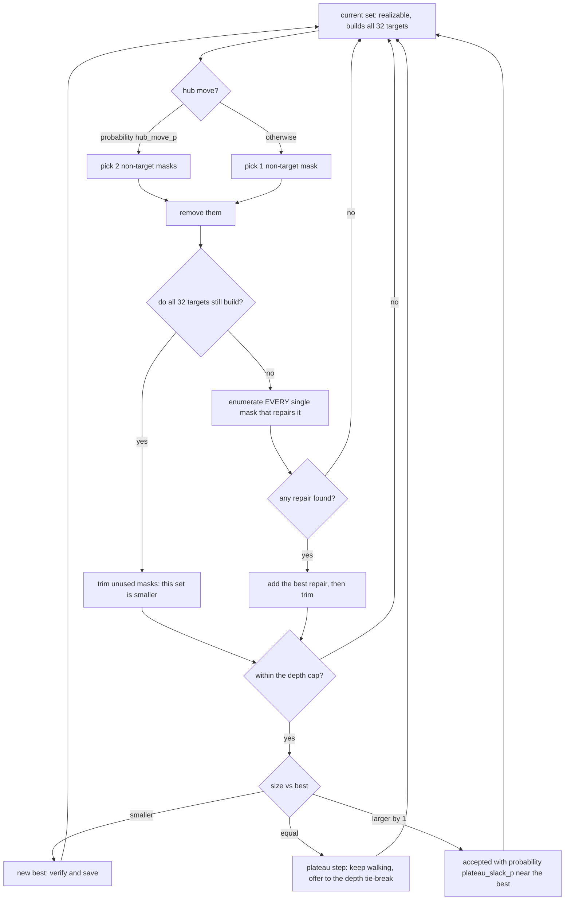
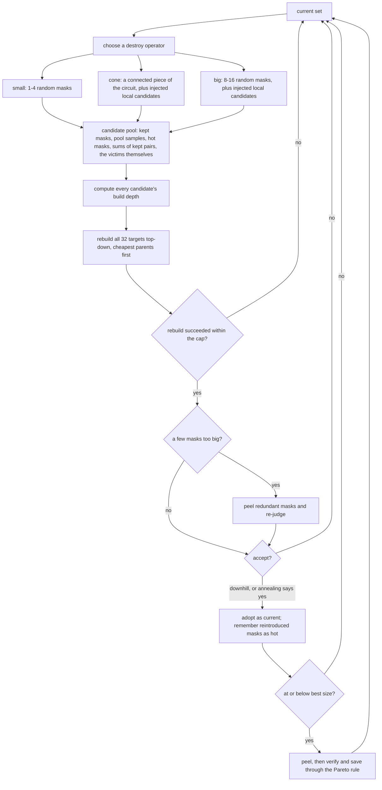
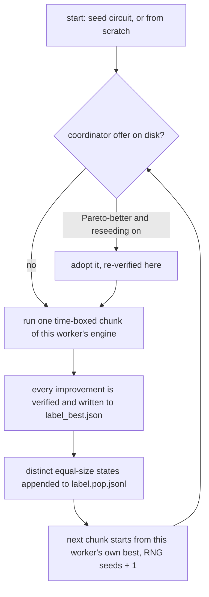
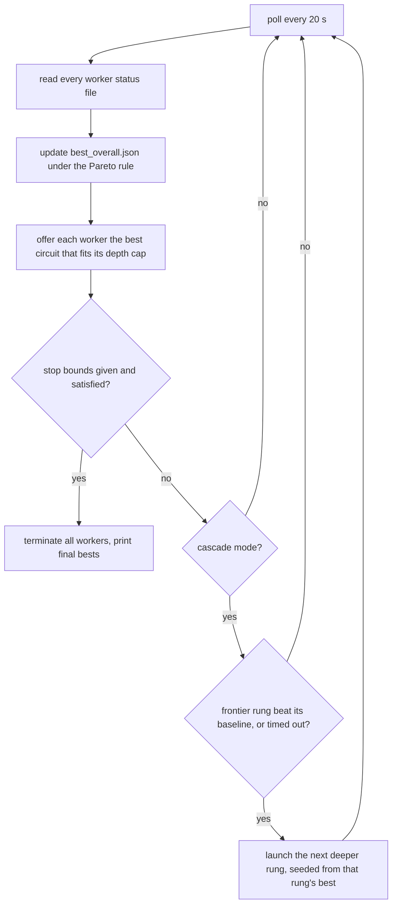

# How the search engine works

This file explains the mechanism. `README.md` next to it explains the
configurations, the knob values and the output files; this one explains what the
code actually does, from the representation up.

Everything here is stdlib Python 3. The four files are
`mixcolumns_core.py` (the problem and the verifier), `engines.py` (the three
search engines), `worker.py` (one search process), `ladder_parallel.py` (the
entry point and coordinator).

## 1. The idea: search over value sets, not over gate lists

The problem is: compute the 32 output bits of AES MixColumns from the 32 input
bits using as few 2-input XOR gates as possible. Because every gate is an XOR,
each signal in a circuit is fully described by *which inputs it is the XOR of* —
a 32-bit mask. Input `i` is the mask `1 << i`; the 32 outputs are 32 fixed
target masks (20 of weight 5, 12 of weight 7) computed from GF(2⁸) in
`mixcolumns_core.mixcolumns_masks()`.

So a circuit is a **set of masks**, and the gate count is just the size of the
set. The wiring does not have to be searched at all: given a set, the code
recovers a legal gate order from it, and rejects the set if no legal order
exists.

| concept | in code | meaning |
|---|---|---|
| value set | `mask_set`, `Ucur`, `S` | the non-input masks a circuit computes; `len` = gate count |
| realizable | `realizable(S)`, `closure(S)` | every mask in the set is the XOR of two masks already available, starting from the 32 inputs, and all 32 targets are reachable |
| depth of a mask | `relax(avail)` | fewest XOR levels needed to build it from the inputs *using only masks in this set*; computed level by level, never trusted from elsewhere |
| feasible at a cap | `feasible_at(S, cap)` | realizable, and every mask builds at depth ≤ `cap` (`cap=None` = no depth limit, realizability only) |
| the circuit itself | `indexpairs_from_masks(S, cap)` | masks emitted in depth order as `[a, b]` index pairs, ready for the verifier |
| trim | `trim_masks(S)` | drop masks that no target's build tree needs |
| peel | `_peel(S, rng, cap)` | drop any single non-target mask the rest of the set can do without, repeatedly |

Two consequences shape the whole engine. Removing one mask from a set is a
one-gate improvement *if the rest still builds all 32 targets* — that is one
membership test, not a re-synthesis. And two circuits of the same size are
different sets, so the engine can walk sideways across equal-size circuits
looking for one that has a removable mask. That sideways walk is where the
smallest circuits came from.

## 2. Two safety rules that apply everywhere

- **Verify before claim.** An engine never reports a gate count. It proposes a
  candidate to `ctx.improve()`, which rebuilds MixColumns from GF(2⁸), replays
  the candidate gate by gate, checks all 32 outputs appear and that depth is
  within the worker's cap, and only then saves it (`worker.py:improve`).
- **Pareto tie-break.** A candidate is accepted when it has *fewer gates, or
  the same gate count at strictly lower depth* (`pareto_better`). Without the
  second clause an equal-size but shallower circuit is silently thrown away —
  which is how depth records are lost. Both 88-gate depth results in this
  project arrived through the second clause, seconds after the same mask set
  first appeared at a greater depth.

## 3. The three engines

| engine | move | good at | depth |
|---|---|---|---|
| `walk` | remove one mask (or two) and, if that breaks the circuit, add back exactly one repair mask | fast sideways motion across equal-size circuits; hundreds of iterations per second | any cap, or uncapped |
| `lns` | destroy a piece of the circuit and re-synthesise it from a candidate pool | pushing a warm-started circuit down by whole gates | any cap, or uncapped |
| `anneal3` | anneal a structural model in which depth 3 holds by construction | reaching a low count at depth exactly 3 from nothing | 3 only |

`alt` is not an engine but a worker mode: it alternates a short `walk` chunk
with a longer `lns` chunk, each starting from the worker's own best. The walk
spreads across the equal-size plateau; the LNS then tries to punch down from
wherever the walk ended up.

### 3.1 `walk` — remove and repair



The load-bearing part is the repair step (`_repair`). It is a **complete
enumeration**, not a sample: let `A` be the closure of the reduced set and
`stuck` the masks that no longer build. A single added mask `w` can only help if
it is itself buildable now (so `w` is a pairwise sum of `A`) and if it unlocks
something stuck (so `w = v ^ a` for some stuck `v` and available `a`).
Intersecting those two sets covers every possible one-mask repair, so "no repair
exists" is a fact, not a timeout. Among valid repairs the code prefers the one
whose trimmed set is smallest, tie-broken by low Hamming weight then by how many
existing masks it pairs with. The masks just removed are forbidden as repairs,
so the walk cannot ping-pong.

Accepting equal-size steps is what makes it a plateau walk. The default
`plateau_slack_p=0.15` also lets it drift one gate uphill near the best, so it
is not trapped in a single equal-size island.

### 3.2 `lns` — destroy and rebuild



Details that matter:

- **The rebuild is greedy top-down** (`_extract`): targets are processed
  deepest-first, and each mask is built from the pair of shallower candidates
  with the lowest *pull-in cost*. Cost classes are 1 for a mask the current
  solution already keeps, 2 for a sampled or injected candidate, 3 for a mask
  just destroyed. Victims staying available at a penalty is why an iteration
  can never dead-end: the rebuild can always fall back on what it destroyed,
  while the penalty pushes it to find something else first.
- **The cone operator** (`_cone_pick`) grows a connected victim set — children
  of victims, plus parents that feed nothing outside the set — using the DAG
  shape behind the current value set (`dag_info`). Removing a connected piece
  leaves a hole that can genuinely be re-planned; removing unrelated masks
  usually just gets them re-derived.
- **Injection** (`_inject`) adds repair candidates aimed at the hole: shifted
  copies of each victim (`victim ^ kept`, `victim ^ input`) and pairwise sums of
  victims. A big destroy has nothing local to rebuild from without them.
- **Peel before accepting** (`peel_window=6`): a rebuild that comes out a few
  masks too big is usually redundant rather than wrong, so it is peeled and
  re-judged instead of being rejected outright.
- **Acceptance** is simulated annealing with reheat by default: uphill moves are
  accepted with probability `exp(-Δ/T)`, `T` cools by `sa_cool` per iteration
  and resets to `sa_T0` after `sa_reheat` iterations without a new best. The
  alternative `accept="threshold"` accepts any move within `up_slack` gates with
  probability `up_prob`; it is the better choice under a tight depth cap, where
  rebuilds are systematically larger and annealing drifts uphill without
  recovering. `snapback` restarts from the best once the current set has drifted
  that many gates above it.
- **Hot pool**: masks a rebuild recently reintroduced go on a hot list, and
  `hot_frac` of pool draws come from it, concentrating candidates on masks that
  have already proved useful in this run.

### 3.3 `anneal3` — the depth-3 model

At depth 3 the circuit shape is forced enough to model directly, so this engine
does not search over mask sets at all. Every output `t` is written as
`t = A ^ B` with both parts buildable at depth ≤ 2; each part of weight 3 or 4
is written as one or two depth-1 pairs of inputs.

| level | what is built | how many gates |
|---|---|---|
| depth 1 | distinct input pairs used by any part | one gate each |
| depth 2 | distinct parts of weight ≥ 3 | one gate each |
| depth 3 | the 32 final XORs `A ^ B` | exactly 32 |

The cost of a state is therefore `32 + (#distinct pairs) + (#distinct parts)`,
maintained by reference counting as choices change, and it *is* the gate count
of the circuit the state emits. The state is: which split each of the 32 outputs
uses, and which pairing each big part uses. Moves are: re-split one output at
random, re-pair one part, or greedily re-split one output to the cheapest
option. Simulated annealing runs first, then greedy descent to a local minimum,
then iterated local search — kick 2 to 6 outputs onto random splits, descend
again, keep the result if it did not get worse. Each restart uses a fresh RNG
seed.

## 4. One worker



A worker never self-stops; the coordinator owns its lifetime. Chunks are
wall-clock (`chunk_s`, and `walk_chunk_s` for the walk half of an `alt`
worker), so two machines of different speeds are at different iteration counts
from the second chunk on.

**Harvesting** (`harvest`, on by default) writes every distinct equal-size mask
set the search visits to `<label>.pop.jsonl`, one JSON mask list per line. The
search constantly walks over sibling circuits of its own size and would
otherwise discard them; that file is what the exact irreducibility certificates
in `../corpus/` were run over. It also grows by megabytes per worker-minute.

**Cross-pollination** (`cross_pollinate`, off by default) merges sibling
workers' harvested masks into this worker's rebuild pool every
`pop_period_s`. It is a real diversifier, but it mixes the mask provenance of
every worker in the run: a circuit found in a pool that contains masks from an
imported circuit is derived from published work. Turn it on only for a run whose
seeds are all your own.

## 5. The coordinator

Every worker is its own OS process. The coordinator polls every `POLL_S = 20`
seconds, reads each worker's `<label>_status.json`, and does three things: keeps
`best_overall.json` current under the Pareto rule, offers each worker the best
circuit that is *feasible at that worker's depth cap* by copying it to
`reseed_<label>.json`, and applies the stop rule.



Two mode shapes:

- **cascade** — the depth ladder. Rung `d3` starts from nothing with `anneal3`.
  Each time the frontier rung beats its baseline by `IMPROVE_BY` gates, or sits
  for `MAX_WAIT_S`, the next deeper rung launches seeded from it. All rungs keep
  running and keep reseeding each other; the last rung can run uncapped.
- **fixed** — a fixed worker set launched at once, each with its own depth cap
  and seed circuit. A worker can set `reseed=False` to refuse offers; the
  87-hunting set does exactly that, because an offer is Pareto-better when it is
  equal-size and shallower, so one reseed pass would collapse independently
  seeded workers onto a single circuit and destroy the diversity that is the
  point of the set.

One stop-rule caveat worth knowing before you script a run: `--stop-gates` /
`--stop-depth` are tested against one Pareto *global* best across all rungs, and
that best never regresses. A deep rung that reaches a small gate count at a
depth above your `--stop-depth` can therefore make the pair unsatisfiable for
the rest of the run, which then only stops on Ctrl-C.

## 6. What it is good at, measured

- **From nothing to 92 gates at depth 4**, cascade mode: reached at t = 9 610 s
  (2.67 h) in the archived run of that configuration.
- **89 gates at depth 5** from this project's own 89@6 and 90@5 circuits,
  `--workers sub89`: **20 s** end to end on a re-run, 2026-09-02 (the archived
  run of the historic configuration took 592 s).
- Throughput on a loaded box: `walk` at 480–640 iterations/s, `lns` at
  100–180 iterations/s.
- Depth 3 from nothing is `anneal3`'s job and it reaches 97 gates there; the
  single-file version of the same model in `../reproduce/` does it in about a
  minute.
- What it is **not** good at: knob tuning. A sweep of 101 runs across a broad
  range of settings around the shipped values produced 0 improvements in gate
  count. The defaults are the measured-good configuration; what moves the
  frontier is which circuit a worker is pointed at.

Two of the four seeds in the `hunt87` set descend from published work; see
`seeds/README.md` before reporting anything those workers produce.

## 7. Run it

```
python3 ladder_parallel.py [--mode cascade|fixed] [--workers hunt87|sub89]
                           [--stop-gates N] [--stop-depth D]
```

```
# from-scratch depth ladder (hours):
python3 ladder_parallel.py --mode cascade --stop-gates 92 --stop-depth 4

# the fixed 87-hunting set, no stop bound, runs until Ctrl-C:
python3 ladder_parallel.py --mode fixed

# the two-worker set that reaches 89 @ depth 5 (seconds):
python3 ladder_parallel.py --mode fixed --workers sub89 --stop-gates 89 --stop-depth 5
```

Output lands in `runs_parallel/<timestamp>/`, including a `code/` copy of the
exact four source files that produced the run. Check any result with the
standalone oracle, which shares no code with the engines:

```
python3 ../verify_circuit.py runs_parallel/<timestamp>/best_overall.json
```
