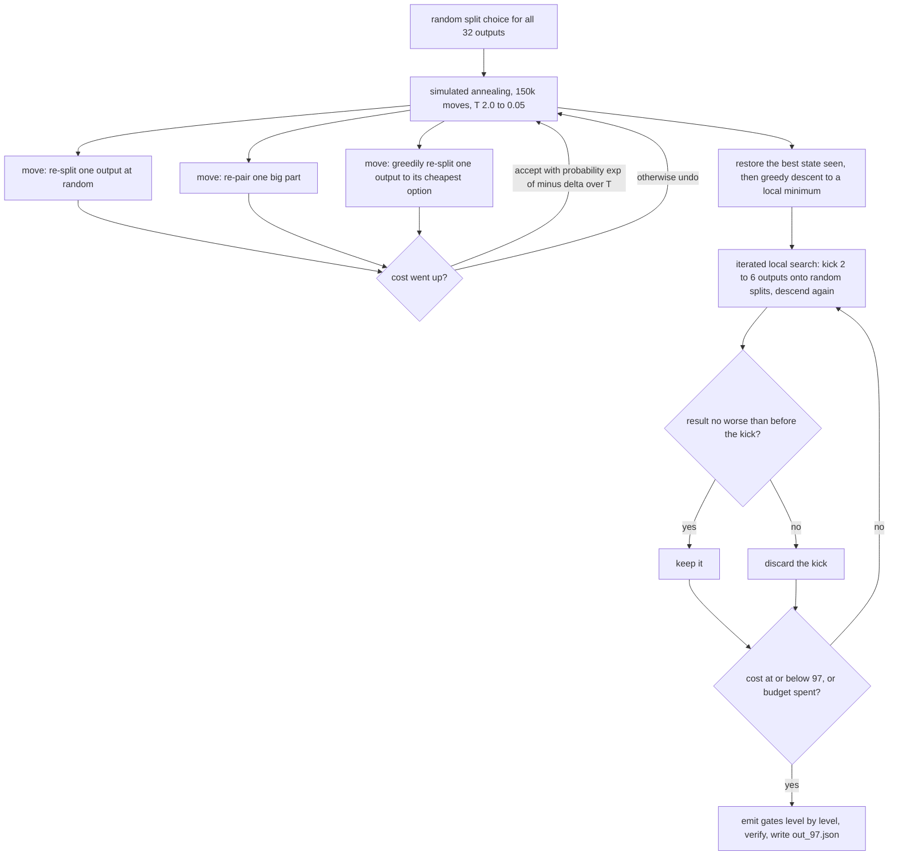
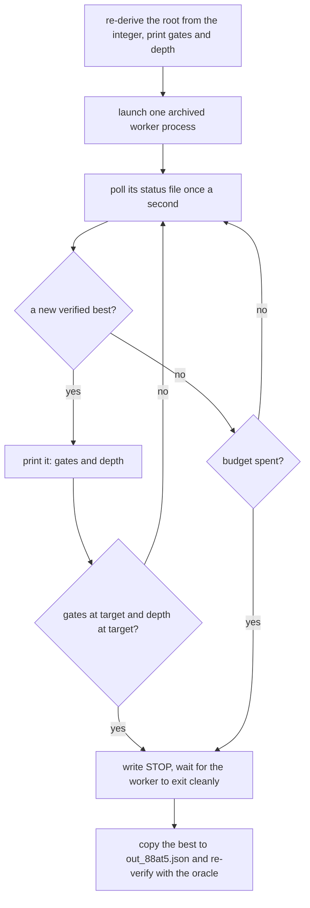

# How the reproductions work

`README.md` next to this file is the manifest: one command per record, what each
one measured, and which records have no command here. This file explains the
*mechanisms* behind those commands, in enough detail to modify them rather than
only run them.

The four pieces of code here are different kinds of thing:

| file | what it is | searches here? |
|---|---|---|
| `reproduce.py` | a self-contained annealer for depth-3 circuits, plus three small demonstrations of the reduction moves on superseded circuits | yes, all of it |
| `construct_91at4.py` | an exact construction for the 91 @ depth 4: it prices the ladder model, solves its eight sector blocks exactly under a depth cap, and assembles | no — it searches over no circuits at all |
| `hunt_88at5.py` | a harness that re-runs one archived search worker from the exact integer root that produced the from-scratch 88 | no — it launches the archived worker |
| `hunt_88.py` | a harness that aims one `../pipeline/worker.py` process at one seed circuit | no — it launches the pipeline worker |

`construct_91at4.py` is the one script here that is not standard-library-only:
it needs `numpy` and `python-sat` for the exact block solves, and its
`construct91/` subfolder holds the generator modules it vendors. The other three
are standard-library Python 3. All four are single-core and check their own output with
`mixcolumns_core.verify()` (a byte-identical copy of the pipeline's) before
reporting anything. Every output file is re-checkable afterwards with the
standalone oracle `../verify_circuit.py`, which shares no code with any of them.

## 1. `reproduce.py` — the depth-3 annealer

`python3 reproduce.py` → **97 gates at depth 3, from nothing, in about a
minute.** No seed circuit: the 32 target masks are computed from GF(2⁸) and
FIPS-197 at import.

### The model

At depth 3 the shape of a circuit is constrained enough to model directly, so
this method never searches over circuits. Every output `t` is written as
`t = A ^ B` where both parts can themselves be built at depth ≤ 2, and each part
of weight 3 or 4 is written as one or two XORs of *input pairs*. That fixes
which gates exist at each level:

| level | gates | count |
|---|---|---|
| depth 1 | each distinct input pair used by any part | 1 gate each |
| depth 2 | each distinct part of weight ≥ 3 | 1 gate each |
| depth 3 | the 32 final XORs `A ^ B` | exactly 32 |

So the cost of a state is `32 + (#distinct pairs) + (#distinct parts)`, and that
number *is* the gate count of the circuit the state emits. Sharing is what
reduces the count: two outputs that choose splits made of the same pairs pay for
those pairs once. The cost is maintained by reference counting inside `State`,
so a move costs close to O(1) rather than a full re-count.

The state is small and fully described by two choices:

- for each of the 32 outputs, **which split** `(A, B)` it uses, from a
  precomputed candidate list (`gen_splits`: for a weight-7 target, all
  4-and-3-bit divisions; for weight-5, also 3-bit divisions and 3-bit divisions
  extended by one bit outside the target — which is what lets a part be shared
  with another output);
- for each part of weight ≥ 3, **which pairing** of input pairs builds it
  (`get_pairings`: 3 options for a weight-4 part, 3 for a weight-3 part).

### The loop



Greedy descent (`descend`) sweeps the 32 outputs in random order, replacing each
one's split with the cheapest available given everything else, then re-pairs
every big part the same way, and repeats until nothing improves. Restarts use
successive RNG seeds; seed 6 is tried first because it is the seed that reaches
97 quickest.

| parameter (`C97`) | default | what it does |
|---|---|---|
| `target_gates` | 97 | stop as soon as a state costs this or less |
| `time_limit_s` | 900 | overall budget across restarts |
| `anneal_iters` | 150 000 | annealing moves per restart |
| `ils_rounds` | 2 500 | kick-and-descend rounds per restart |
| `sa_T0` / `sa_T1` | 2.0 / 0.05 | start and end temperature, geometric schedule |
| `seeds` | `[6, 1, 2, …]` | restart RNG seeds, in order |
| `max_depth` | 3 | the depth the emitted circuit is checked against |

**Measured:** 57.4 s and 51.8 s on two re-runs (2026-09-02, one core, both
reaching cost 97 on seed 6); 81 s on 2026-07-27; 60–156 s across earlier runs.
This is the only method in the project that reaches 97 gates at depth 3;
closed-form constructions are faster but reach only 116 gates. The same model is
the `anneal3` engine in `../pipeline/engines.py`.

### The three other methods in the file

`python3 reproduce.py 91 89 90` runs demonstrations of the reduction moves on
superseded circuits. Each states one move in readable form, and each runs in
seconds to minutes:

| name | seed | move demonstrated |
|---|---|---|
| `91` | the published 92-gate circuit | walk sideways across equal-size circuits by neutral swaps until one gate becomes removable |
| `89` | a 90-gate circuit of this project | the value-set walk: remove-1 and remove-2-add-1 moves with repair |
| `90` | a 91-gate circuit of this project | prove a circuit admits no single local cut, and optionally run a small destroy-and-rebuild loop |

The current engine is not this code. See `../pipeline/HOW.md` for the moves as
they are now implemented.

## 2. `hunt_88at5.py` — the from-scratch descent to 88 gates

```
python3 hunt_88at5.py                      # 88 @ depth 5; archived: 64 min
python3 hunt_88at5.py --rng 2163 --target-depth 6
python3 hunt_88at5.py --rng 2050 --target-depth 0   # the cheapest 88 at any depth
```

### What "from scratch" means here

There is no seed circuit. The starting point is
`constructors.build("naive", 1958)`: a **randomized XOR tree** — shuffle the 32
targets, and for each one shuffle its input bits and combine them pairwise into
a balanced tree, reusing any subexpression already built. It is a pure function
of the integer, reads nothing from disk, and for 1958 it produces 146 gates at
depth 3, the same root the archived record run opened on. The script re-derives
that root and prints its gate count and depth *before* launching anything, so a
wrong root is visible immediately.

### What actually searches

`hunt_88at5.py` contains no search code of its own. It launches one process of
the archived worker that produced the record —
`../evidence/campaign87_run_2026-07-28_got_88at6_fromscratch/code/hunt_worker.py`
— so the knobs, the chunk lengths and the uncapped depth all come from the
archived file and cannot drift from the ones that ran. That worker is the same
shape as `../pipeline/worker.py`: alternating `walk` and `lns` chunks
(120 s / 420 s here), uncapped depth, verify-before-claim, Pareto tie-break,
plateau harvesting. The engines are the ones documented in
`../pipeline/HOW.md` §3.

The descent that reaches 88 is the plateau walk: the walk engine removes a
value, repairs by complete enumeration when removal breaks the circuit, and
accepts equal-size results, so it moves across thousands of distinct circuits of
the current size until one of them has a value that can be dropped outright. The 88-gate
value set first appears at depth 6, and the Pareto tie-break carries the *same
set* to depth 5 a few seconds later (6.1 s, in the archived run).



### The one archived setting this harness overrides

The archived worker rotates roots: it abandons a root after 90 minutes
(`--restart-s`) or after 40 minutes with no local improvement (`--stall-s`).
That is right for a many-worker fleet searching many roots for days and wrong for a
script whose entire job is to re-run *one* root, so both timers are pushed past
the budget and the root is held. The difference is material: measured
2026-09-02, on a fast idle core the walk reaches 89 gates in 559 s and then
needs one lucky walk chunk, so the 40-minute stall clock would fire at
t = 3 240 s and drop the record's root ten minutes *before* the archived descent
reached 88 from it. Pass `--rotate-roots` for the archived behaviour instead,
which past about 40–90 minutes stops being a re-run of this root and becomes an
open-ended search.

### What reproduces exactly and what does not

The root and the first chunk are exact: the engines take the seed *integer*, and
it advances by +1 per chunk, so a fresh worker started with `--rng 1958` puts its
first restart in the same state as the record's restart. Chunk boundaries are
wall-clock, so from the second chunk on a machine of a different speed is at a
different iteration and the trajectories part. This is a stochastic search: a
re-run can be faster, much slower, or miss inside its budget — two re-runs on
2026-09-02 reproduced the descent to 89 gates in 558 s but did not reach 88
within 164 minutes.

## 3. `hunt_88.py` — aiming the pipeline at one seed circuit

```
python3 hunt_88.py                 # 88 @ depth 7 from this project's 94-gate seed
python3 hunt_88.py --minutes 120
```

Same harness shape as above — write the shipped configuration into a run folder,
launch **one** `../pipeline/worker.py` process, poll its status file, stop on
target or budget — with two differences: the knobs come from
`../pipeline/ladder_parallel.py` *by import*, so they cannot drift from the
shipped ones, and the worker starts from a seed circuit rather than a
constructed root (a 94-gate depth-5 circuit of this project's own lineage, kept
with the archive of the record it produced). Mode `alt`, uncapped depth, RNG
seed 1010 — the record worker's own settings.

Both the gate target and the depth target matter for the stop rule. The walk
reaches the 88-gate value set at some larger depth first, and the Pareto
tie-break carries that same size down to depth 7 seconds later; stopping on the
gate count alone returns an 88 at depth 8–11.

**Measured:** 19.4 min with the shipped stop rule (re-validated 2026-07-27); the
archived run took 32.9 min. A single worker is a fair re-run of the archived
worker — every improvement on it came out of its own chunks — but it does not
reproduce the contribution of the other nine workers.

## 3b. `construct_91at4.py` — the 91 @ depth 4, constructed

No search. The ladder model reads the 32 MixColumns targets off GF(2⁸) and the
trace-dual basis, splits them into eight sector blocks, and prices one
configuration — eight currency shapes and three diagonal menus, a literal in the
driver — at 91 gates. Each block is then handed to an exact minimum-gate solver
**with the depth cap as a constraint**, so a block that cannot meet the cap
fails with an error rather than emitting a deeper circuit; the eight solves come
back at 7 gates each and take about a second in total from an empty cache. The
resulting value set is scheduled at its minimum depth, dead gates are stripped,
and the emitted file is checked twice — in process against targets rebuilt from
the field, then by `../verify_circuit.py` as a subprocess.

The model's optimum is exactly 91. That is a statement about that model class,
not a lower bound: nothing here says a 90 @ depth 4 is impossible.

## 4. Checking any of it independently

```
python3 ../verify_circuit.py out_97.json 3
python3 ../verify_circuit.py out_88at5.json 5
python3 ../verify_circuit.py out_88hunt.json 7
```

The oracle rebuilds MixColumns from GF(2⁸), replays the circuit, and prints the
gate count, the computed depth, how many of the 32 outputs are built, and a
verdict; the optional second argument asserts a depth bound. Exit status is 0
only on a fully valid circuit within that bound. Checking one level shallower
and seeing `VIOLATED` is how each depth claim is shown to be tight.
