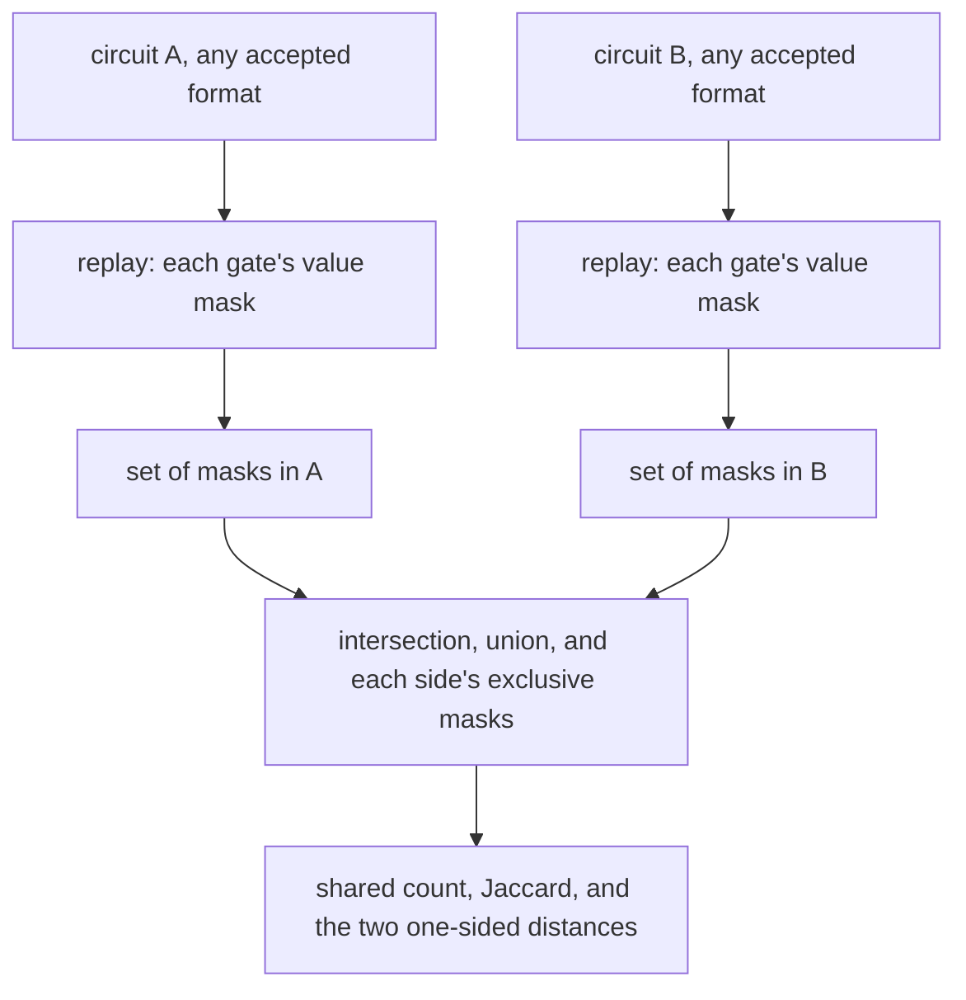

# How the overlap statistic works

`overlap.py` answers one question about two circuits: **how many of the same
intermediate values do they compute?** It is the statistic this project uses to
say whether two solutions are the same family or genuinely different ones, and
it is standard-library Python 3.

## 1. The idea

Replay each circuit and collect the **set** of masks its gates compute — a mask
being which inputs a signal is the XOR of. Then compare the two sets. Because
masks are values, the comparison is blind to gate order, signal numbering, file
format and any relabelling: two files that describe the same circuit differently
score 100 % overlap, and two circuits built by unrelated routes score low even
if they happen to use the same number of gates.



| reported field | meaning |
|---|---|
| `gates_a` / `gates_b` | gate counts as read |
| `distinct_masks_a` / `_b` | distinct values each circuit computes |
| `repeated_masks_a` / `_b` | gates recomputing a value the circuit already has — waste, and a hint to run the tripwire |
| `shared` | values in both |
| `union` | values in either |
| `jaccard` | `shared / union` |
| `only_a` / `only_b` | the two one-sided distances: how many values each circuit would have to acquire |

## 2. How to read it

The project's working line is **Jaccard ≥ 0.7 means the same family**, and it
publishes calibration pairs rather than asking you to take the threshold on
faith. Two reference points:

| pair | shared | Jaccard |
|---|---|---|
| this project's 88 at depth 7 vs the published foreign 88 | 61 | 0.530 |
| the project's own calibration pair | 63 | 0.553 |

Genuinely different optima sit about **42 gate-changes apart** by the one-sided
distances, which is the number that makes every small-radius negative in this
repository local rather than global.

The tool deliberately does *not* verify either circuit, and overlap is not
evidence of derivation — two independent searches over the same problem share
values because small solutions are scarce, not because one copied the other.
Both caveats are printed with the report.

## 3. Run it

```
python3 scripts/overlap.py A.json B.json
python3 scripts/overlap.py A.json B.json --list-shared     # dump the shared masks
python3 scripts/overlap.py A.json B.json --json            # machine-readable
python3 scripts/overlap.py A.json B.json --inputs 32       # non-MixColumns problems
```

Accepted circuit formats are the same four the tripwire takes: index pairs in
JSON, a bare list of pairs, mask triples, or plain text with one `a b` per line.
Exit 0 on success, 2 if a file cannot be parsed.

The companion instrument is [`../tools/tripwire.py`](../tools/HOW.md), which
looks for a deletable gate inside a single circuit.
