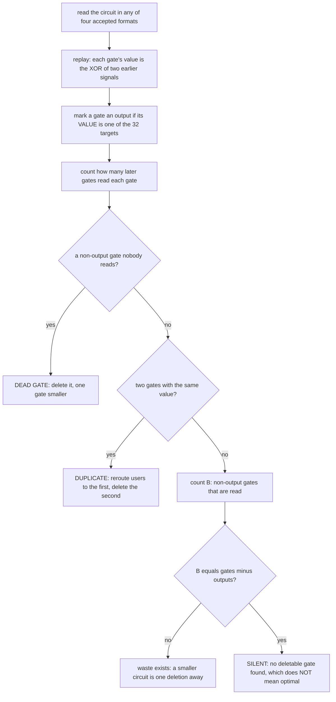

# How the tripwire works

`tripwire.py` is the cheapest instrument in this repository. Point it at any
XOR circuit for MixColumns, from any source; within seconds it either stays
silent or returns a strictly smaller circuit. It is standard-library Python 3
and takes no arguments beyond file names.

A byte-identical copy is at `../corpus/tripwire_demo/tripwire.py`, next to the
planted-defect controls and a transcript. That directory shows the tool
firing.

## 1. The idea in plain words

Replay the circuit and compute each gate's **value** — the 32-bit mask of which
inputs that signal is the XOR of ([`../DEFINITIONS.md`](../DEFINITIONS.md)) —
then count which gates read which. Three checks follow:

- a **dead gate** is one whose value no later gate reads and which is not an
  output. It is wasted: delete it and the circuit is one gate smaller.
- a **duplicate** is two gates computing the same value. Reroute the later one's
  users to the first and delete it.
- **B** is the number of gates that feed later gates but are not outputs — the
  *middle* gates. Every gate is either an output or a middle, so in a circuit
  with `n` gates computing `q` outputs and no waste, `B = n - q` exactly. On an
  88-gate MixColumns circuit that means **B = 56**.

The third check is one comparison, and it is the one that proves waste without
having to locate it. `B <= n - q` always holds on a valid circuit, so
**`B != n - q` proves waste exists**, and the first two checks then name it. On
any 88 from any source, `B != 56` means an 87 is one deletion away.

The arrow only points one way, and the tool documents its own counterexample:
`../corpus/tripwire_demo/circuits/planted_dup.json` is a deliberately wasteful
89-gate circuit whose `B` is exactly `89 - 32`. Silence is therefore evidence of
nothing; a fire is a constructive result.



Whether a gate is an output is decided by its **value**, not by its position: a
gate counts as an output if its value is one of the 32 targets, wherever it
appears in the file. The tool therefore depends on no convention about which
gates are "the last 32".

## 2. What it accepts

Four input formats, dispatched on the first non-whitespace character:

| format | shape |
|---|---|
| index pairs in JSON | `{"gates": [[a, b], …]}` — extra keys ignored |
| a bare list | `[[a, b], …]` |
| mask triples | `{"gates": [{"m":…, "a":…, "b":…}, …]}` in build order |
| plain text | one `a b` per line; commas accepted; `#` comments and blank lines skipped |

Signals `0..31` are the inputs (`signal i` = mask `1 << i`), gate `k` produces
signal `32 + k`, and both parents must be strictly earlier — a forward reference
is a hard error, not a warning.

By default the 32 targets are AES MixColumns, rebuilt from GF(2⁸) inside the
tool and self-checked against the known weight profile (20 masks of weight 5, 12
of weight 7). `--target matrix.txt` replaces them with an arbitrary dependency
matrix — rows are outputs, columns are inputs — so the same instrument works on
any XOR problem, with the row width becoming the input count.

## 3. How to check the instrument itself

`--selftest CIRCUIT` takes a circuit you believe is clean and checks the
instrument three ways: the circuit as given must stay **silent**; the same
circuit with one of its gates duplicated must report a duplicate; and the same
circuit with a junk gate appended must report a dead gate. A tool that could
never fire would report silence on every input, and this check confirms in one
second that this one can fire.

The demo directory ships the two planted defects prebuilt, along with the
builder that makes them, so a fire can be reproduced rather than only read
about: one 89-gate file carrying a duplicated value that has been rewired to
have a real consumer (the `B`-rule counterexample), and one 89-gate plain-text
file with an appended dead gate (which the `B` rule catches on its own).

Exit status: `0` if every file was silent, `1` if any file fired or the self-test
failed, `2` if a file could not be read or parsed.

## 4. What it found, at three scales

Six known 88-gate circuits, including a published one of foreign lineage, all
report `n=88 B=56 expect=56` and stay silent, in 0.3 s total. Both planted files
fire in 0.1 s each.

**At corpus scale, three different populations were screened, and the three
numbers are not interchangeable.** `B` is a property of the *wiring*, so it can
only be computed where a build order exists; the other two tests need only the
value set.

| population | size | which test ran | result |
|---|---:|---|---|
| circuits carrying a full build order | **28,796** | the **complete** screen: dead gates, duplicate values, **and `B`** | silent on all |
| distinct 88-gate value sets in the corpus index | **1,575,516** | value-set checks only — mask distinctness and the 32 targets. **`B` cannot be computed from a value set** | silent on all |
| local circuit files on disk at census time | **17,283** | the complete screen, as a file-level census (this is the count `leads.md` #1 quotes) | silent on all |

That silence is the negative result this instrument produces. It is also the
reason to run an 88 of a *new* lineage through it: the test takes seconds and is
the cheapest available attempt at an 87.

## 5. Run it

```
python3 tools/tripwire.py CIRCUIT.json [MORE.json …]
python3 tools/tripwire.py --quiet CIRCUIT.json          # one line per file
python3 tools/tripwire.py --selftest CIRCUIT.json       # check the instrument
python3 tools/tripwire.py --target matrix.txt CIRCUIT.json
```

With no files and no `--selftest` it prints its help and exits 2.

The companion instrument is [`../scripts/overlap.py`](../scripts/HOW.md), which
measures how many values two circuits share.
